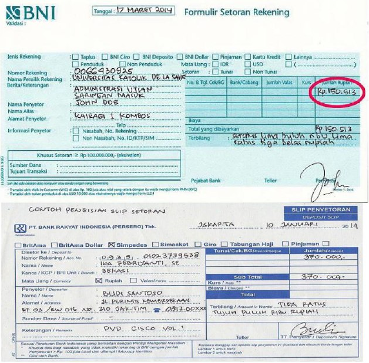
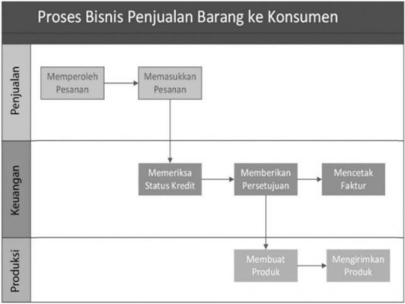
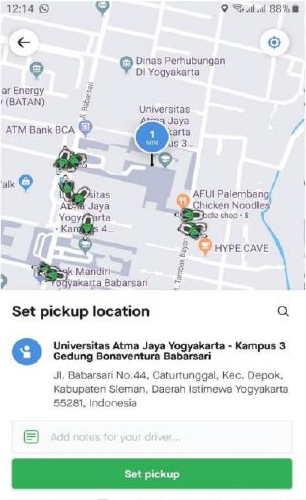
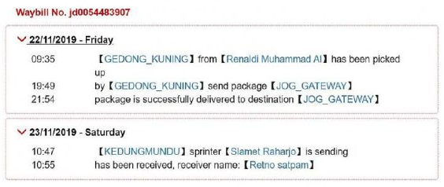
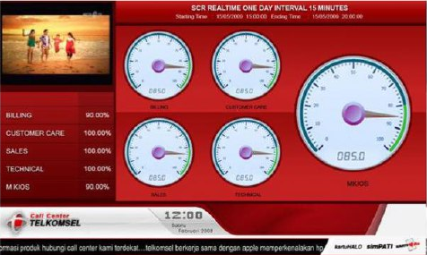
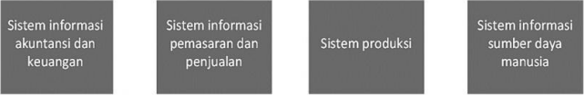
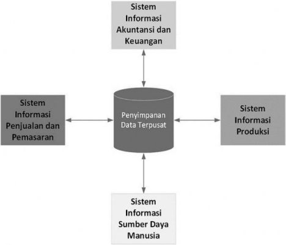
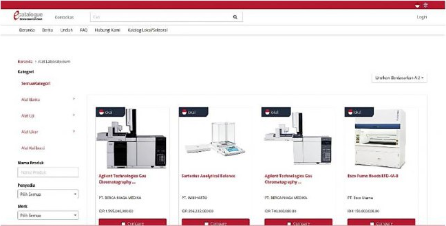
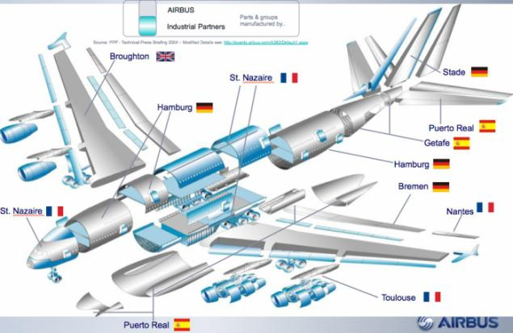

# Bisnis Global dan Kolaborasi Secara Elektronik

Peran sistem informasi modern adalah membantu perusahaan untuk mencapai berbagai hal baru yang sebelumnya sulit untuk dilakukan. Salah satu pencapaian tersebut adalah bersaing di pasar global. Seperti yang telah disampaikan di [Modul 1](../M1/README.md), banyak perusahaan di Indonesia berskala menengah dan kecil dapat bersaing secara internasional. Selain persaingan, ternyata banyak perusahaan yang juga melakukan kolaborasi guna menghadapi persaingan internasional. Untuk dapat memahami bagaimana hal tersebut terjadi, maka kita perlu mempelajari terlebih dahulu bagaimana cara kerja suatu perusahaan ditinjau dari sudut sistem informasi manajemen.

## Daftar Isi

- [Bisnis Global dan Kolaborasi Secara Elektronik](#bisnis-global-dan-kolaborasi-secara-elektronik)
  - [Daftar Isi](#daftar-isi)
  - [Proses Bisnis](#proses-bisnis)
  - [Perbaikan Proses Bisnis dengan Teknologi Informasi](#perbaikan-proses-bisnis-dengan-teknologi-informasi)
    - [Sistem Informasi dalam Hirarki Organisasi](#sistem-informasi-dalam-hirarki-organisasi)
      - [Sistem Pengolahan Transaksi](#sistem-pengolahan-transaksi)
      - [Sistem untuk Intelegensi Bisnis](#sistem-untuk-intelegensi-bisnis)
      - [Mengintegrasikan Sistem Informasi](#mengintegrasikan-sistem-informasi)
        - [ERP](#erp)
        - [SCM](#scm)
        - [CRM](#crm)
        - [KMS](#kms)
      - [E-Business](#e-business)
      - [Kolaborasi dalam Bisnis](#kolaborasi-dalam-bisnis)
      - [Fungsi Sistem Informasi dalam Bisnis](#fungsi-sistem-informasi-dalam-bisnis)
  - [Rangkuman](#rangkuman)

## Proses Bisnis

Dalam kegiatannya sehari-hari, setiap perusahaan harus berurusan dengan berbagai informasi. Informasi tersebut terkait dengan pemasok, konsumen, pegawai, faktur, pembayaran, pajak, dan lain sebagainya. Aktivitas perusahaan yang menggunakan berbagai informasi tersebut perlu dikelola sehingga dapat berjalan dengan efisien, meningkatkan kinerja, dan mencapai tujuan. Pengelolaan informasi tersebut menggunakan sistem informasi yang akan membantu dalam pembuatan keputusan dan meningkatkan kualitas eksekusi proses bisnis.

Proses bisnis didefinisikan sebagai cara suatu pekerjaan atau tugas diorganisir, dikoordinasikan, dan difokuskan untuk menghasilkan suatu barang atau jasa yang memiliki nilai lebih (Gelinas, Sutton, & Fedorowicz, 2008; Parkes, Blount, Considine, & Olesone, 2016; Romney & Steinbart, 2014). Jadi rangkaian proses bisnis digunakan untuk menghasilkan barang atau jasa yang akan dijual oleh perusahaan. Aktivitas menghasilkan barang dan jasa didukung oleh aliran material, informasi, dan pengetahuan di antara para partisipan dalam sebuah proses bisnis. Proses bisnis suatu perusahaan mengandung keunikan yang berbeda antar perusahaan. Bisa dilihat misalnya, bagaimana prosedur pengambilan uang tunai di berbagai bank memiliki perbedaan mulai dari formulir setoran, identitas yang dibutuhkan, otorisasi, dan lainnya. Perusahaan atau organisasi dapat dilihat juga sebagai sekumpulan proses bisnis yang saling terkait (Laudon & Laudon, 2018). Gambar 2.1. menunjukkan perbedaan formulir setoran antara BNI dan BRI.

Gambar 2.1
Slip Setoran di BNI dan BRI

Berbagai proses bisnis dapat dikelompokkan berdasarkan area fungsionalnya seperti nampak pada tabel 2.1.

Tabel 2.1
Proses Bisnis dalam Area Fungsiona

| Area Fungsional         | Proses Bisnis                                                                              |
| ----------------------- | ------------------------------------------------------------------------------------------ |
| Manufaktur dan Produksi | Merakit produk, Memeriksa kualitas produk, Merancang produk baru, Penjualan dan Pemasaran. |
| Penjualan dan Pemasaran | Mengidentifikasi konsumen, Membuat iklan, Menjual produk.                                  |
| Keuangan dan Akuntansi  | Membayar utang pada pemasok, Menyiapkan laporan keuangan, Mengelola aliran kas.            |
| Sumber Daya Manusia     | Merekrut karyawan, Mengevaluasi kinerja karyawan, Administrasi ketenagakerjaan.            |

Kinerja suatu perusahaan tergantung pada seberapa baik perancangan, koordinasi, dan eksekusi berbagai proses bisnis. Dengan proses bisnis yang efisien, ringkas, dan cepat, maka suatu perusahaan dapat menang bersaing. Sebaliknya, suatu perusahaan dapat kalah bersaing ketika memiliki proses binis yang tidak efisien, rumit, dan memiliki banyak kesalahan. Proses bisnis yang baik juga memungkinkan suatu perusahaan berinovasi.

Ada proses bisnis yang hanya terkait dengan satu bidang fungsional. Misalnya pendidikan dan pelatihan merupakan proses di bawah bidang fungsional manajemen sumber daya manusia. Ada proses bisnis yang melintasi berbagai bidang fungsional sehingga membutuhkan koordinasi antar bidang yang baik. Sebagai contoh penjualan produk sampai diterima oleh konsumen pada perusahaan dagang yang melibatkan setidaknya tiga bidang fungsional. Bidang penjualan dan pemasaran untuk penjualan ke pelanggan, bidang keuangan untuk mengelola penerimaan kas, dan bidang produksi terkait dengan pembuatan dan pengiriman barang. Gambar 2.2. menunjukkan proses tersebut.

Sumber: Laudon & Laudon (2018)

Gambar 2.2
Proses Bisnis Lintas Bidang Fungsional

## Perbaikan Proses Bisnis dengan Teknologi Informasi

Perbaikan proses bisnis menggunakan teknologi informasi dapat dilakukan dengan berbagai cara. Cara pertama yang paling sering dilakukan adalah dengan mengotomatiskan langkah kerja manual. Sebagai contoh, langkah memeriksa status kredit dan memberikan persetujuan dapat digantikan dengan aplikasi komputer. Perkembangan selanjutnya tidak hanya mengotomatiskan langkah manual saja, melainkan mengubah aliran informasi, memangkas langkah, dan bahkan sampai menghasilkan proses bisnis baru yang lebih baik dan efisien. Sebagai contoh, Gojek menggabungkan layanan ojek, telepon pintar dengan GPS (Global Positioning System), dan aplikasi berbasis telepon pintar untuk menyediakan layanan transportasi berbasis lokasi. Gojek dapat memberikan layanan dengan dasar perhitungan seperti layaknya taksi dengan argometer, kemudahan menemukan pelanggan dan pengemudi, serta komunikasi antar mereka.

Gambar 2.3
Aplikasi Gojek Memungkinkan Melihat Posisi Pengemudi

Teknologi informasi memungkinkan munculnya proses bisnis baru selain tentunya mengubah cara berbisnis suatu perusahaan. Netflix mengubah bisnis utamanya dari persewaan DVD (Digital Versatile Disc) melalui pos di awal dekade 2000an menjadi layanan streaming berkat perkembangan teknologi dan infrastruktur telekomunikasi. Amazon dapat menyediakan layanan komputasi awan sebagai alternatif sumber penghasilan selain penjualan eceran secara daring, juga karena perkembangan teknologi informasi.

Pemahaman terhadap proses bisnis suatu perusahaan menjadi hal penting. Dengan memahami proses bisnis, kita dapat memahami cara kerja suatu perusahaan. Selain itu kita juga dapat menganalisa dan mengevaluasi kelemahan dan kekurangan proses bisnis untuk dapat diperbaiki. Perbaikan tersebut akan meningkatkan efisiensi dan efektivitas proses bisnis. Pada akhirnya pemahaman proses bisnis dapat membantu untuk merancang proses bisnis baru dengan bantuan teknologi informasi.

### Sistem Informasi dalam Hirarki Organisasi

Tiap level manajerial akan menghadapi permasalahan yang berbeda dan cara kerja yang berbeda, dengan demikian kebutuhan informasinya juga berbeda. Kebutuhan informasi yang berbeda tersebut disediakan oleh sistem informasi yang berbeda. Tiap bidang fungsional utama (akuntansi dan keuangan, penjualan dan pemasaran, manufaktur dan produksi, dan sumber daya manusia) awalnya didukung oleh sistem informasi tersendiri. Di era sekarang keseluruhan sistem informasi fungsional tersebut harus dapat diintegrasikan. Integrasi sistem memungkinkan setiap bagian berbagi informasi yang dibutuhkan dalam rangka koordinasi proses bisnis. Pada umumnya sistem informasi pada suatu perusahaan dibagi menjadi dua berdasarkan fungsinya, yaitu sistem pengolahan transaksi (_transaction processing systems_) dan sistem intelegensi bisnis (_business intelligence systems_).

#### Sistem Pengolahan Transaksi

Manajer yang bertanggung jawab atas kegiatan operasional rutin perusahaan membutuhkan sistem informasi yang membantu untuk mengetahui kondisi aktivitas dan transaksi dasar. Sebagai contoh aktivitas dan transaksi dasar antara lain penjualan, penerimaan kas, pembayaran utang, aliran bahan baku di pabrik, dan lain sebagainya. Sistem pengolahan transaksi adalah suatu sistem informasi terkomputerisasi yang menjalankan dan mencatat transaksi rutin harian (Turban, Pollard, & Wood, 2018). Transaksi rutin harian ini merupakan aktivitas penting bagi perusahaan. Tujuan utama sistem pengolahan transaksi adalah untuk menjawab pertanyaan rutin dan melacak aliran informasi yang mengalir pada sebuah perusahaan. Sebagai contoh adalah kapan kiriman barang akan sampai, berapa banyak utang ke pemasok yang harus dibayar hari ini, berapa banyak pesanan untuk produk tertentu masuk hari ini, dan lain sebagainya. Informasi untuk menjawab pertanyaan tersebut dapat tersedia dengan cepat dan seketika. Gambar 2.4 menunjukkan status pengiriman barang oleh sebuah perusahaan kurir.

Gambar 2.4
Contoh Keluaran Sistem Pengolahan Transaksi

Pada tingkatan manajeman operasional berbagai hal seperti penugasan, sumber daya, dan sasaran, sudah ditetapkan sebelumnya dan sangat terstruktur. Memutuskan apakah akan menerima pesanan pelanggan pada sebuah perusahaan penjualan eceran sudah terdefinisi dengan baik. Pembuat keputusan tinggal melihat apakah ada persediaan yang memadai untuk memenuhi pesanan tersebut.

Manajer membutuhkan sistem pengolahan transaksi untuk memantau kondisi internal perusahaan dan hubungannya dengan pihak eksternal. Sistem pengolahan transaksi juga merupakan sumber informasi bagi sistem lain di dalam perusahaan. Misalnya data penjualan yang dicatat dapat digunakan untuk mengevaluasi kinerja karyawan bagian penjualan, menganalisa penguasaan pasar, dan mengevaluasi dampak iklan yang telah dipublikasikan.

Meskipun terlihat sederhana, repetitif, dan terstruktur, sistem pengolahan transaksi memiliki peran penting. Bayangkan saja jika sistem pengolahan transaksi milik suatu bank berhenti beroperasi selama beberapa jam, berapa besar kerugian yang diakibatkannya. Berapa banyak transaksi perbankan yang tidak dapat diolah, berapa banyak kerugian nasabah, berapa banyak kehilangan pendapatan dari biaya transaksi, dan yang lebih parah menurunnya kredibilitas bank tersebut di mata nasabah.

#### Sistem untuk Intelegensi Bisnis

Data yang dikumpulkan dari aktivitas pengolahan transaksi bisnis tidak hanya berhenti ketika aktivitas atau transaksi tersebut telah selesai diolah dan diproses. Sistem intelegensi bisnis membantu pembuatan keputusan manajerial dengan cara melakukan analisis terhadap data bisnis yang disimpan perusahaan (yang diantaranya dihasilkan oleh sistem pengolahan transaksi). Keputusan bisnis rasional dibuat berdasarkan informasi yang berkualitas. Hasil analisis data tersebut diharapkan menyediakan informasi yang dibutuhkan. Beberapa jenis sistem informasi yang termasuk dalam kategori sistem intelegensi bisnis adalah sistem informasi manajemen, sistem pendukung keputusan, dan sistem informasi eksekutif (Laudon & Laudon, 2018; Turban et al., 2018).

Sistem informasi manajemen yang dimaksud di sini bukanlah disiplin ilmu sistem informasi melainkan sistem informasi yang dirancang bagi manajemen tingkat menengah untuk membuat keputusan bersifat rutin dan terstruktur. Sistem informasi manajemen memberikan informasi terkait kinerja perusahaan. Informasi kinerja perusahaan tersebut digunakan manajer tingkat menengah untuk memantau dan mengendalikan jalannya perusahaan dan memprediksi apa yang akan terjadi. Sistem informasi manajemen umumnya akan memberikan informasi yang telah ditentukan sebelumnya dan tidak memiliki kemampuan analisa lanjut. Misalnya laporan pencapaian target penjualan berdasarkan tenaga penjualan, produk, atau area penjualan.

Sistem pendukung keputusan dirancang untuk mendukung pembuatan keputusan non rutin dan semi terstruktur. Keputusan non rutin dan semi terstruktur biasanya menyangkut permasalahan yang unik (sehingga tidak dapat didefinisikan sebelumnya) dan berubah dengan cepat. Metode pembuatan keputusan seperti dalam sistem informasi manajemen tidak dapat digunakan. Contoh keputusan dalam sistem pendukung keputusan misalnya adalah apa dampaknya terhadap jam kerja karyawan pabrik jika penjualan dinaikkan 75% pada bulan Januari 2020, apa dampak terlambatnya penyelesaian gedung pabrik baru terhadap biaya investasi, dan lainnya. Sistem pendukung keputusan menggunakan informasi yang disediakan sistem pengolahan transaksi dan sistem informasi manajemen ditambah informasi dari sumber eksternal.

Sistem informasi eksekutif membantu manajemen senior untuk membuat keputusan tidak rutin dan tidak terstruktur. Keputusan manajemen senior biasanya membutuhkan wawasan, penilaian, dan evaluasi mendalam. Sistem informasi eksekutif menyediakan berbagai informasi dari sumber internal dan eksternal yang dibutuhkan untuk membuat keputusan. Sistem informasi eksekutif milik PT Telkomsel dapat mengambil data internal (yang terdiri dari beberapa milyar baris data) setiap 15 menit, mengolahnya, dan menyajikan informasi dalam bentuk dashboard kepada direksi dalam waktu kurang dari 5 detik seperti nampak pada gambar 2.5 di bawah ini.

Sumber:: <http://klikanan.com/project-digital-signage-for-data-dashboard/>

Gambar 2.5
Dashboard PT Telkomsel

#### Mengintegrasikan Sistem Informasi

Berbagai sistem informasi yang berbeda dalam suatu perusahaan perlu untuk diintegrasikan. Kendala yang terjadi selama ini adalah masing-masing sistem informasi fungsional tidak dapat langsung berbagi informasi. Berbagi informasi memerlukan proses birokrasi khusus. Sebagai dampaknya organisasi menjadi lambat dalam bertindak. Fenomena ini disebut sebagai silo informasi seperti dalam gambar 2.6.

Gambar 2.6
Silo Informasi

Untuk mengatasi hal tersebut dikembangkanlah aplikasi enterprise. Aplikasi enterprise merupakan perangkat lunak yang meliputi dan mengelola secara terintegrasi melintasi berbagai area fungsional bisnis. Aplikasi enterprise dilengkapi dengan penyimpanan data tunggal yang menjadi pusatnya. Model aplikasi enterprise dapat dilihat di gambar 2.7.

Sumber: Laudon & Laudon (2018)

Gambar 2.7
Aplikasi Enterprise

Dengan menggunakan aplikasi enterprise, semua aktivitas bisnis dan proses bisnis dapat dikoordinasikan dengan baik dan menjadi lebih fleksibel. Aplikasi enterprise biasanya terdiri atas empat aplikasi utama, yaitu _Enterprise Resource Planning_ (ERP), _Supply Chain Management_ (SCM), _Customer Relationship Management_ (CRM), dan _Knowledge Management Systems_ (KMS) (Laudon & Laudon, 2018; Turban et al., 2018).

##### ERP

ERP merupakan sebuah aplikasi yang mengintegrasikan berbagai proses bisnis fungsional dalam perusahaan. Keseluruhan data dari berbagai proses bisnis fungsional tersebut disimpan dalam satu pusat penyimpanan data. Data yang disimpan dan dikelola secara terpusat tersebut dapat digunakan oleh berbagai bagian dalam perusahaan secara seketika. Misalnya saat pesanan dari pelanggan dimasukkan ke dalam ERP oleh bagian penjualan, maka bagian akuntansi dan keuangan dapat langsung membuatkan faktur bagi konsumen, bagian produksi dapat langsung mengerjakan pesanan konsumen, dan bagian SDM dapat memperhitungkan komisi penjualan bagi tenaga penjualan.

##### SCM

SCM adalah aplikasi untuk mengelola relasi dengan para pemasok. SCM membantu berbagai perusahaan dalam satu rantai pasokan untuk saling berbagi informasi mengenai kebutuhan barang, tingkat persediaan, pengiriman, dan lainnya. Dengan menggunakan SCM diharapkan aktivitas rantai pasokan dan logistik dapat menjadi lebih efisien tanpa mengurangi kualitas dan menjaga kesinambungan pasokan.

##### CRM

CRM merupakan aplikasi untuk mengelola relasi dengan para konsumen. Inti dari CRM adalah mendapatkan informasi mengenai siapa konsumen, apa yang mereka butuhkan atau inginkan, preferensi pribadi mereka, dan lainnya. Dengan informasi akurat mengenai konsumen, setiap perusahaan dapat memusatkan perhatian pada cara untuk memenuhi kebutuhan atau keinginan konsumen tersebut sesuai dengan preferesi tiap konsumen. Upaya CRM tidak berhenti pada saat produk sudah terjual melainkan juga pada masa setelah penjualan. Sebagai contoh, perusahaan sepatu dapat menawarkan produk perawatan sepatu pada konsumen atau menyediakan jasa perawatan sepatu.

##### KMS

KMS adalah sistem yang digunakan untuk mengelola pengetahuan di dalam suatu organisasi. Pengetahuan tiap organisasi merupakan hal yang unik. Cara setiap organisasi melakukan seleksi karyawan misalnya, akan berbeda. Perbedaan ini merupakan dampak dari akumulasi pengetahuan yang dimiliki suatu organisasi. KMS melakukan upaya mendokumentasikan pengetahuan, menjaga, mengembangkan, dan menyemaikan pengetahuan tersebut.

#### E-Business

Ketika Internet menjadi popular dan banyak digunakan, maka kesempatan untuk memanfaatkan bagi kepentingan bisnis pun muncul. Ketika bisnis dijalankan melalui media komunikasi internet maka disebut sebagai _E-Business_ (Rainer & Turban, 2009; Turban, Lee, King, & Chung, 2000; Turban et al., 2018). Jadi _E-Business_ dapat didefinisikan sebagai penggunaan teknologi digital untuk menjalankan bisnis (termasuk proses bisnis). Aktivitas _E-Business_ meliputi proses bisnis internal dan juga eksternal yang melibatkan pihak ketiga seperti konsumen, pemasok, dan regulator.

Sebagian dari proses bisnis, yaitu berdagang juga dapat dilakukan secara elektronik dan disebut sebagai _E-Commerce_ (Laudon & Laudon, 2018; Rainer, Prince, & Watson, 2013). Istilah _E-Commerce_ inilah yang lebih dahulu muncul dan terkenal, sehingga ada anggapan bahwa semua aktivitas bisnis menggunakan teknologi digital disebut sebagai _E-Commerce_. Kini _E-Commerce_ di Indonesia marak dan meliputi berbagai aktivitas terkait perdagangan seperti pemasaran dan periklanan, pengiriman barang, pembayaran transaksi, dan lainnya.

Perkembangan teknologi _E-Business_ juga dimanfaatkan oleh pemerintah. Berbagai layanan pemerintah kepada masyarakat sekarang dapat dilakukan menggunakan teknologi digital. Fenomena ini yang disebut sebagai _E-Government_ (Heeks, 2006; Wang & Liao, 2008). Layanan _E-Government_ memungkin pemerintah menyemaikan informasi yang dibutuhkan masyarakat, berdialog dengan masyarakat, dan bahkan bertransaksi dengan masyarakat. Pemerintah Indonesia sudah cukup lama memiliki dan menyelenggarakan layanan katalog elektronik dalam rangka pengadaan barang dan jasa pemerintah seperti nampak pada gambar 2.8.

Sumber: <https://e-katalog.lkpp.go.id/id/katalog/produk/alat-laboratorium/64?first=true>

Gambar 2.8
Katalog Elektronik Pemerintah Indonesia

#### Kolaborasi dalam Bisnis

Dalam menjalankan bisnis, berbagai proses bisnis harus dilakukan dandikoordinasikan antar bagian fungsional perusahaan. Kadang koordinasi danpelaksanaan proses bisnis harus dilakukan tanpa kesempatan untuk berada pada ruangdan waktu yang sama (tatap muka). Pada bagian ini akan dibahas bagaimana kolaborasidapat dilakukan dengan menggunakan bantuan teknologi informasi.

Kolaborasi didefinisikan sebagai bekerja sama dengan orang lain untuk mencapai tujuan bersama (Fawcett, Wallin, Allred, Fawcett, & Magnan, 2010; Patrakosol & Olson, 2007; Sandee & Rietveld, 2001; Stefik et al., 1987). Kolaborasi dapat dilakukan oleh beberapa orang di dalam perusahaan maupun antar perusahaan. Dengan kolaborasi, kekuatan tiap partisipan diharapkan untuk bersinergi dan membantu pencapaian tujuan bersama. Kolaborasi dapat dilakukan dalam jangka pendek maupun jangka panjang, baik antar perorangan, organisasi, maupun melibatkan partisipan yang beragam.

Kolaborasi dapat dilakukan secara formal maupun informal. Kelompok karyawan yang secara formal ditugaskan untuk melakukan suatu pekerjaan bersama disebut sebagai tim. Setiap tim biasanya memiliki penugasan dan sasaran tertentu. Anggota tim harus berkolaborasi untuk dapat menyelesaikan penugasan dan mencapai sasaran dengan baik. Kolaborasi sangat penting karena (Laudon & Laudon, 2018):

a. Berubahnya sifat dan lingkungan pekerjaan. Cara kerja lama, di mana tiap langkah dalam proses dilakukan secara independen dan dikoordinasikan oleh pengawas, tidak lagi relevan. Cara kerja lama tersebut mengisolasi karyawan dalam silo sehingga tidak dapat segera menanggapi masalah bersama. Interaksi antar karyawan dalam bekerja sekarang tidak lagi dianggap kegiatan yang membuang waktu melainkan aktivitas esensial untuk mengkoordinasikan pekerjaan. Interaksi dapat berupa diskusi, berkirim email, presentasi, dan persuasi.

b. Tumbuhnya pekerja profesional. Interaksi merupakan pekerjaan untuk para profesional seperti pengacara, konsultan, dan lainnya. Pekerjaan para profesional tersebut memerlukan kolaborasi dan koordinasi. Para profesional tersebut dalam menjalankan tugasnya harus berbagi ilmu pengetahuan yang diperoleh dari pendidikan dan pengalaman kerjanya.

c. Berubahnya tata organisasi dalam perusahaan. Bentuk organisasi yang berjenjang (hirarki) sudah ketinggalan jaman. Struktur organisasi yang terlalu gemuk memperlambat komunikasi terkait pekerjaan. Saat ini kecenderungan yang terjadi adalah tim bekerja secara mandiri untuk mencapai tujuan. Supervisi oleh manajer berubah menjadi berorientasi pada hasil bukan lagi proses. Proses pengawasan tidak lagi melibatkan para manajer secara langsung dalam proses kerja tim, melainkan didelegasikan ke tim.

d. Berubahnya ruang lingkup perusahaan. Saat ini banyak perusahaan beroperasi di lebih dari satu lokasi. Berkat kemajuan teknologi informasi, koordinasi dan komunikasi kerja menjadi lebih mudah. Tim dapat bekerja sama dari berbagai lokasi dan waktu yang berbeda tanpa harus bertatap muka terlalu sering. Banyak produk modern dibuat oleh berbagai pabrik yang berbeda, seperti Airbus A380 di gambar 2.9.

Sumber: <https://bashny.net/uploads/images/00/00/35/2013/11/11/89af4fc6be.jpg>

Gambar 2.9
Pabrikan Komponen Airbus A380

e. Penekanan pada inovasi. Banyak perusahaan besar saat ini yang dianggap inovatif, sangat jarang atau bahkan tidak pernah didirikan dan dikelola oleh seorang individu. Microsoft pada awal berdirinya digawangi oleh Bill Gates dan Paul Allen. Mereka kemudian mempekerjakan banyak karyawan yang bekerja sama untuk menghasilkan berbagai produk unggulan. Google, Facebook, Twitter, dan lainnya juga memiliki pola yang sama. Munculnya inovasi sampai kemudian inovasi tersebut diterima dan digunakan oleh orang banyak merupakan hasil kerja tim.

f. Berubahnya budaya kerja dan bisnis. Berbagai penelitian menunjukkan bahwa tim yang terdiri dari anggota yang beragam latar belakang, kompetensi, dan keahlian, cenderung menghasilkan keluaran yang lebih baik dan bekerja lebih cepat. Dalam bisnis, budaya kerja sama didorong supaya menjadi kebiasaan yang mendarah daging.

Kolaborasi bisnis tidak hanya dilakukan di dalam perusahaan tetapi juga merambah melibatkan pihak di luar perusahaan. Kolaborasi diperlukan guna koordinasi kegiatan rantai pasokan dengan pemasok, distributor, dan pengecer. Kolaboarsi memang diperlukan, tidak hanya untuk koordinasi internal, tetapi juga eksternal. Setiap kegiatan hanya akan dilakukan oleh suatu perusahana jika dirasakan membawa manfaat. Kolaborasi juga tidak terkecuali. Beberapa manfaat kolaborasi adalah (Laudon & Laudon, 2018):

a. Produktivitas
Dengan kolaborasi maka tiap partisipan dapat berkontribusi sesuai kompetensi unggulan masing-masing. Tingkat kesalahan akan menurun karena lebih banyak yang memperhatikan dan mencermati.

b. Kualitas
Kolaborasi memungkinkan para partisipan menemukan dan menyelesaikan masalah dengan lebih cepat. Kolaborasi juga mempersingkat waktu perancangan produk, program, lainnya.

c. Inovasi
Beberapa penelitian menunjukkan bahwa kolaborasi lebih banyak menghasilkan ide inovatif dibandingkan kerja mandiri.

d. Pelayanan pada konsumen
Ketika konsumen membutuhkan pelayanan, seringkali diperlukan koordinasi antar bidang. Misalnya konsumen mengeluhkan barang yang diterima rusak, maka perlu koordinasi bagian penjualan, produksi, dan pengiriman barang untuk menyelesaikan masalah. Jika kemudian solusinya adalah pengembalian barang, maka perlu kerja sama dengan bagian keuangan untuk mengembalikan pembayaran dari konsumen.

e. Kinerja keuangan
Sebagai dampak semua hal di atas, maka perusahaan yang mengoptimalkan kolaborasi dapat meraih laba yang tinggi. Kinerja keuangan perusahaan akan membaik dan perusahaan dapat bertumbuh.

Ada berbagai perangkat dan produk teknologi informasi yang digunakan untuk mendukung kolaborasi. Beberapa produk teknologi informasi yang biasa kita jumpai, antara lain:

a. Email dan layanan pesan singkat.
b. Wiki yang memungkinkan para partisipan membuat dan berbagi dokumen elektronik.
c. Dunia virtual untuk keperluan pelatihan dan simulasi.
d. Platform kolaborasi sosial seperti Yammer, Teams, Workplace dari Facebook, dan lainnya.

#### Fungsi Sistem Informasi dalam Bisnis

Sampai bagian ini sudah banyak dibahas manfaat sistem informasi bagi organisasi. Untuk fungsi yang vital bagi organisasi diperlukan pengelola yang mumpuni. Pada bagian ini akan dibahas bagian dalam suatu organisasi yang bertanggung jawab untuk mengelola fungsi sistem informasi dalam suatu organisasi. Unit terkecil yang bertugas mengelola sistem informasi biasanya disebut sebagai departemen atau bagian sistem informasi. Dulu bagian ini sering disebut sebagai bagian pengolahan data elektronik (_Electronic Data Processing_ atau EDP). Tanggung jawab bagian sistem informasi adalah mengelola infrastruktur teknologi informasi yang terdiri atas perangkat keras, perangkat lunak, penyimpanan data, dan jaringan (Davis, Schiller, & Wheeler, 2007; Hall & Singleton, 2005; Weber, 1999).

Bagian sistem informasi memiliki personil yang memiliki keahlian di bidang analisis dan perancangan sistem, pemrograman perangkat lunak, manajer proyek, dan manajer sistem informasi. Kerja para personil ini juga ditunjang oleh pihak eksternal seperti pemasok dan penyedia jasa telekomunikasi. Terkadang, para konsultan eksternal juga turut berpartisipasi.

Pada perusahaan besar, posisi manajer bagian sistem informasi berada sejajar dengan jajaran direksi lain. Posisi yang umum adalah sebagai _Chief Information Officer_ (CIO) atau direktur teknologi informasi yang bertanggung jawab langsung pada _Chief Executive Officer_ (CEO) atau direktur utama. Seorang CIO diharapkan memiliki kompetensi bisnis yang kuat di samping penguasaan teknologi informasi. Seorang CIO diharapkan mampu mengintegrasikan solusi teknologi informasi ke dalam pencapaian strategi perusahaan. Dalam banyak perusahaan multinasional, CIO dibantu oleh beberapa orang dengan posisi sebagai (Turban et al., 2018):

a. _Chief Security Officer_ yang bertanggung jawab atas aspek keamanan sistem informasi perusahaan.
b. _Chief Privacy Officer_ yang bertanggung jawab atas aspek kepatuhan regulasi privasi data.
c. _Chief Knowledge Officer_ yang bertanggung jawab atas pengelolaan pengetahuan perusahaan.
d. _Chief Data Officer_ yang bertanggung jawab atas pengelolaan dan pemanfaatan data perusahaan.

Tiap perusahaan atau oganisasi akan memiliki tata kelola fungsi sistem informasi tersendiri. Perusahaan kecil mungkin tidak akan memiliki bagian sistem informasi tersendiri melainkan akan ada bagian atau orang yang menjalankan fungsi tersebut dan merangkap fungsi lainnya. Pada perusahaan besar, bagian sistem informasi merupakan bagian dengan personil berjumlah besar dengan berbagai spesialisasi yang akan bertugas di area pengembangan dan operasional sistem informasi atau yang sering disebut DevOps (Jabbari, bin Ali, Petersen, & Tanveer, 2016).

## Rangkuman

1. Proses bisnis adalah suatu pekerjaan atau tugas yang diorganisir, dikoordinasikan, dan difokuskan untuk menghasilkan barang atau jasa dalam suatu perusahaan. Perusahaan dapat dilihat sebagai kumpulan berbagai proses bisnis. Dalam menjalankan proses bisnis, perusahaan membutuhkan aliran material, informasi, dan pengetahuan. Proses bisnis yang dirancang dan dieksekusi dengan baik dapat memberikan keunggulan bagi suatu perusahaan.
2. Teknologi informasi dapat memperbaiki dan meningkatkan proses bisnis. Cara pertama adalah dengan mengotomatiskan langkah-langkah dalam proses bisnis yang masih manual. Cara kedua adalah dengan menyederhanakan proses bisnis. Cara ketiga adalah dengan menciptakan proses bisnis yang baru menggunakan teknologi informasi.
3. Sistem informasi dalam suatu perusahaan terdiri dari sistem pengolahan transaksi yang berfungsi untuk menjalankan dan mencatat transaksi rutin harian dan sistem intelegensi bisnis yang mengolah dan menganalisa data dari sistem pengolahan transaksi guna pembuatan keputusan dalam rangka pengelolaan perusahaan.
4. Berbagai sistem informasi fungsional dalam perusahaan harus diintegrasikan guna mengoptimalkan kinerja. Aplikasi enterprise adalah sistem yang mengintegrasikan berbagai sistem informasi fungsional dalam satu wadah. Aplikasi enterprise terdiri atas _Enterprise Resource Planning_, _Supply Chain Management_, _Customer Relationship Management_, dan _Knowledge Management_.
5. Sistem informasi juga mendukung kolaborasi dalam perusahaan maupun antar perusahaan sebagai mitra bisnis.

---

Selanjutnya [Kegiatan Belajar 2 - Peran Sistem Informasi dalam Organisasi dan Strategi Bisnis](kb-02.md)
