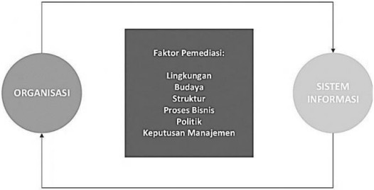
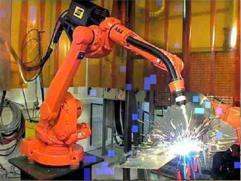
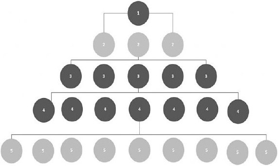
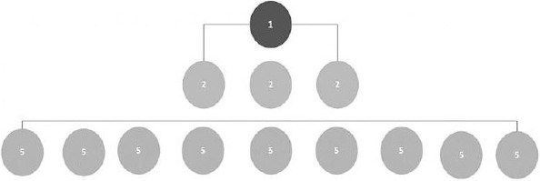
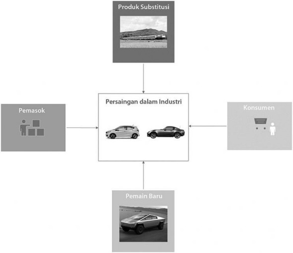
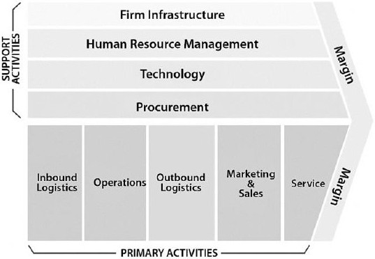

# Peran Sistem Informasi dalam Organisasi dan Strategi Bisnis

Pembahasan mengenai peran penting sistem informasi dalam organisasi tidak dapat meninggalkan pembahasan mengenai organisasi. Suatu sistem informasi dibangun untuk mendukung organisasi dan demikian pula sebaliknya, organisasi mempengaruhi pengembangan sistem informasi. Pada kegiatan belajar 2 ini akan dibahas aspek organisasi terutama perusahaan dalam konteks sistem informasi.

## Daftar Isi

- [Peran Sistem Informasi dalam Organisasi dan Strategi Bisnis](#peran-sistem-informasi-dalam-organisasi-dan-strategi-bisnis)
  - [Daftar Isi](#daftar-isi)
  - [Organisasi](#organisasi)
    - [Fitur Organisasi](#fitur-organisasi)
      - [Rutinitas dan proses bisnis](#rutinitas-dan-proses-bisnis)
      - [Politik organisasi](#politik-organisasi)
      - [Budaya organisasi](#budaya-organisasi)
      - [Lingkungan organisasi](#lingkungan-organisasi)
      - [Struktur Organisasi](#struktur-organisasi)
  - [Dampak Sistem Informasi pada Organisasi](#dampak-sistem-informasi-pada-organisasi)
  - [Strategi Bisnis](#strategi-bisnis)
    - [Model Kekuatan Persaingan](#model-kekuatan-persaingan)
      - [Model Kekuatan Persaingan Porter](#model-kekuatan-persaingan-porter)
        - [Pesaing tradisional](#pesaing-tradisional)
        - [Masuknya pemain baru](#masuknya-pemain-baru)
        - [Barang dan jasa substitusi](#barang-dan-jasa-substitusi)
        - [Konsumen](#konsumen)
        - [Pemasok](#pemasok)
      - [Model Rantai Nilai Bisnis](#model-rantai-nilai-bisnis)
    - [Strategi Generik Untuk Bersaing](#strategi-generik-untuk-bersaing)
      - [1. Strategi biaya terendah](#1-strategi-biaya-terendah)
      - [2. Diferensiasi produk](#2-diferensiasi-produk)
      - [3. Fokus pada ceruk pasar](#3-fokus-pada-ceruk-pasar)
      - [4. Memperkuat hubungan dengan pemasok dan konsumen](#4-memperkuat-hubungan-dengan-pemasok-dan-konsumen)
  - [Tantangan Sistem Informasi Strategis](#tantangan-sistem-informasi-strategis)
  - [Rangkuman](#rangkuman)

Interaksi antara organisasi dan sistem informasi termasuk cukup kompleks dan dipengaruhi berbagai faktor pemediasi, seperti nampak pada gambar 2.10. Memperkenalkan sebuah sistem informasi baru ke dalam setiap organisasi akan membawa perubahan sosial (Rogers, 1995; Shih, Kraemer, & Dedrick, 2008). Perubahan tersebut harus dipahami dan diantisipasi supaya tidak berdampak negatif.

Sumber: Laudon & Laudon (2018)

Gambar 2.10
Hubungan Organisasi dan Sistem Informasi

Seringkali dampak implementasi teknologi baru tidak dapat dengan mudah diprediksi. Ketidakpastian tersebut merupakan tantangan bagi manajemen suatu perusahaan.

Pembahasan di bagian ini akan dimulai dari konsep organisasi dan dampak teknologi terhadap organisasi. Pembahasan akan dilanjutkan dengan membahas sisi strategis sistem informasi, termasuk apa itu strategi.

## Organisasi

Organisasi didefinisikan sebagai struktur sosial formal yang stabil, mengambil sumber daya dari lingkungan sekitarnya untuk diolah guna menghasilkan keluaran (Coghlan & Brannick, 2014; Lin, Lin, Huang, & Jalleh, 2011; Luscher & Lewis, 2008; Neyland, 2008; Whitaker, Mithas, & Krishnan, 2010; Williamson, 1981). Definisi ini merupakan definisi dari sudut pandang teknis. Organisasi merupakan produsen barang dan jasa yang mendapatkan faktor produksi dari lingkungan di sekitarnya.

Organisasi dikatakan stabil karena lebih tahan lama dibandingkan dengan kelompok informal seperti kelompok arisan teman kantor. Organisasi disebut formal karena memiliki legitimasi secara legal dan memiliki seperangkat regulasi internal yang sesuai dengan peraturan dan perundang-undangan yang berlaku. Organisasi dikatakan sosial karena anggotanya adalah manusia yang berinteraksi satu dengan lainnya.

Definisi lain organisasi adalah kumpulan hak, kewajiban, wewenang, dan tanggung jawab (Fishbein & Ajzen, 1975; Robbins, 2003). Kesemuanya itu diseimbangkan sejalan dengan aktivitas organisasi. Tentunya dalam menyeimbangkan kewajiban, hak, wewenang, dan tanggung jawab akan terjadi konflik dan penyelesaiaan konflik.

Dengan memperhatikan definisi organisasi secara teknis, maka sistem informasi akan berfokus pada bagaimana implementasi teknologi baru akan mempengaruhi pengolahan masukan menjadi keluaran. Faktanya tidak sesederhana itu. Memperkenalkan teknologi baru dipastikan akan membawa dampak sosial. Misalnya memberikan fasilitas smartphone dan laptop bagi karyawan dapat berdampak negatif terhadap kehidupan pribadinya karena beban pekerjaan dapat dikerjakan di luar jam kantor. Dengan demikian selain faktor teknis, sistem informasi juga harus memperhatikan faktor non teknis.

Setiap organisasi memiliki karakteristik tertentu. Setiap organisasi memiliki struktur yang disertai dengan pembagian wewenang dan tugas. Dalam setiap organisasi akan terdapat birokrasi dan hirarki yang menjelaskan bagaimana pembagian tugas, wewenang, dan tanggung jawab dilakukan. Pelaksanaan tugas dan wewenang tersebut diatur dengan sekumpulan aturan, kebijakan, dan kesepakatan. Selain itu terdapat juga pertanggungjawaban dan akuntabilitas pelaksanaan tugas dan wewenang.

### Fitur Organisasi

Tiap organisasi akan memiliki fitur-fitur berikut ini (Laudon & Laudon, 2018):

#### Rutinitas dan proses bisnis

Seiring berjalannya waktu, tiap organisasi akan membentuk dan mengembangkan kegiatan rutin. Dalam perusahana kegiatan rutin adalah untuk menghasilkan barang atau jasa. Kegiatan rutin tersebut sering juga disebut sebagai Standard Operating Procedures (SOP). SOP merupakan aturan, prosedur, dan praktek yang dikembangkan untuk menghadapi berbagai situasi yang telah diperkirakan akan terjadi. Setiap anggota organisasi dalam menjalan SOP diharapkan akan menjadi fasih dan efisien. Dengan SOP, diharapkan penggunaan sumber daya organisasi menjadi hemat dan efisien.

#### Politik organisasi

Setiap orang dalam organisasi akan memiliki kepentingan, pemikiran, sudut pandang, dan agenda yang berbeda. Perbedaan ini akan mempengaruhi bagaimana sumber daya organisasi dialokasikan dan digunakan. Perbedaan ini akan mengakibatkan adanya konflik dan perebutan sumber daya yang terbatas. Konflik yang terjadi dapat menghambat pengembangan dan implementasi sistem informasi baru. Keberhasilan untuk menemukan resolusi konflik yang baik merupakan kunci sukses penerapan sistem informasi baru.

#### Budaya organisasi

Budaya organisasi adalah rangkaian asumsi dasar, tata nilai, dan kepercayaan yang dipegang oleh anggota organisasi yang mendefinisikan bagaimana suatu organisasi berdiri, berinteraksi, dan beraktivitas (Bagchi, Hart, & Peterson, 2004; Hofstede, 1997; Kleiner, 2000). Budaya organisasi yang kondusif dapat membantu pengembangan dan penerapam sistem informasi baru. Sebaliknya, budaya organisasi yang tertutup dan enggan berubah dapat menghambat bahkan menggagalkan sistem informasi baru.

#### Lingkungan organisasi

Organisasi dan lingkungannya saling mempengaruhi. Sebagai contoh suatu perusahaan harus mematuhi aturan mengenai tata ruang, ketenagakerjaan, dan perpajakan untuk dapat beroperasi di suatu wilayah. Perusahaan pada gilirannya akan berkontribusi pada perekonomian wilayah dengan mempekerjakan penduduk sekitar pabrik, membeli bahan dari wilayah tersebut, dan lainnya. Lingkungan usaha biasanya akan berubah dengan cepat. Sistem informasi dapat membantu perusahaan untuk merespon kondisi lingkungan yang berubah. Dengan mempercepat waktu respon, maka perusahaan dapat beradaptasi dan bahkan mengantisipasi perubahan dengan cepat pula. Salah satu perubahan cepat yang berpotensi menghambat adalah adanya teknologi disruptif.

#### Struktur Organisasi

Struktur organisasi tiap perusahaan akan berbeda. Perusahaan kecil cenderung memiliki struktur yang fleksibel dan luwes. Pemilik usaha dapat merangkap pengantar barang dan fungsi gudang. Semakin besar perusahaan, maka struktur dan pembagian tugas, wewenang, dan tanggung jawab akan semakin jelas dan kaku. Ada pula struktur yang unik seperti perguruan tinggi dimana pejabat biasanya adalah dosen yang mendapat giliran menjadi pejabat struktural. Jika nanti sudah selesai menjabat, maka dosen tersebut akan kembali menjadi dosen biasa. Oleh sebab itu, seorang pejabat struktural di perguruan tinggi biasanya tidak memiliki kekuasaan sebesar manajer di perusahaan biasa.

## Dampak Sistem Informasi pada Organisasi

Pada bagian ini akan dibahas berbagai dampak sistem informasi pada organisasi. Dampak dapat berupa ekonomi serta organisasi dan perilaku. Akan dibahas pula dampak Internet terhadap organisasi.

Dampak ekonomi teknologi informasi pada organisasi yang paling utama adalah pada biaya. Biaya modal dan biaya informasi menjadi berbeda. Investasi pada teknologi informasi saat ini dipandang sebagai faktor produksi dan bukan lagi sebagai faktor pendukung organisasi. Biaya untuk mendapatkan teknologi informasi dan saat ini banyak tenaga kerja manusia digantikan oleh teknologi dalam berbagai proses bisnis. Secara historis, biaya tenaga kerja manusia selalu mengalami kenaikan. Gambar 2.11 merupakan contoh robot menggantikan manusia untuk melakukan pekerjaan las.

Sumber: <https://proleevo.com/mengenal-proses-pengelasan-di-industri-otomotif-part-2/>

Gambar 2.11
Robot Melakukan Pekerjaan Las

Seiring berjalannya waktu, banyak faktor produksi lain juga digantikan oleh teknologi informasi sehingga biayanya juga menurun. Selain menurunkan biaya produksi dan operasi, teknologi informasi juga menurunkan biaya transaksi (Williamson, 1981). Biaya transaksi adalah biaya yang harus dikeluarkan oleh sebuah perusahaan untuk mencari informasi, negosiasi, dan akhirnya bertransaksi. Secara tradisional biaya transaksi (membeli dari pemasok) lebih mahal daripada membuat sendiri. Dengan teknologi informasi biaya transaksi dapat diturunkan sehingga biaya transaksi menurun. Dengan demikian, perusahaan dapat berkonsentrasi pada bisnis utama dan yang lain membeli dari pemasok. Fenomena inilah yang mendasari alih daya (_outsourcing_).

Teknologi informasi juga dapat menurunkan biaya manajemen secara internal. Biaya manajemen yang dapat dikurangi adalah biaya untuk melakukan supervisi pada para karyawan. Pada perusahaan besar biaya supervisi ini cukup besar karena keterbatasan ruang lingkup pengendalian dari para manajer. Teknologi informasi membantu para manajer memperluas ruang lingkup pengawasannya, sehingga para manajer dapat mengawasi dan mengendalikan lebih banyak karyawan. Dengan demikian, biaya untuk pengawasan dan pengendalian karyawan menurun karena jumlah manajer yang dibutuhkan juga menurun meski jumlah karyawan tidak menurun. Bahkan dengan mengubah ukuran kinerja dari berorientasi proses menjadi hasil, perusahaan dapat memperkerjakan karyawan di lokasi yang berbeda tanpa perlu pengawasan ketat harian.

Teknologi informasi mengubah bagaimana cara organisasi dijalankan dan dikendalikan. Beberapa perubahan yang diakibatkan oleh penerapan teknologi informasi, antara lain (Laudon & Laudon, 2018; Rainer & Turban, 2009; Turban et al., 2018):

a. Teknologi informasi mengubah struktur organisasi menjadi lebih langsing dengan cara memangkas birokrasi. Pada organisasi tradisional, manajer tingkat menengah dibutuhkan guna menjadi perantara informasi dari bawah ke atas, maupun sebagai distributor informasi dari atas ke bawah seperti nampak pada gambar 2.12.

Gambar 2.12
Struktur Organisasi Konvensional

Peran manajer di lapisan nomor 3 dan 4 adalah menerima informasi dari lapis di bawahnya, meringkas, dan kemudian melaporkan ke lapis di atasnya. Selain itu manajer di lapisan nomor 3 dan 4 juga bertugas menterjemahkan kebijakan manajemen di atasnya untuk diteruskan ke lapis di bawahnya.

Dengan teknologi informasi maka, lapis manajemen nomor 3 dan 4 tidak lagi dibutuhkan sehingga struktur organisasi dapat berubah menjadi seperti gambar 2.13.

Gambar 2.13
Struktur Organisasi Modern

Organisasi menjadi lebih langsing karena lapisan alur informasi berkurang dan waktu tunggu pengolahan informasi juga berkurang. Semua hal tersebut dicapai tanpa mengurangi kualitas informasi yang disampaikan. Dapat dilihat bagaimana teknologi informasi dapat mengurangi biaya manajemen dengan cara memangkas birokrasi yang fungsinya hanya sebagai penyalur informasi.

b. Teknologi informasi memungkinkan pelimpahan tugas dan wewenang kepada lapis manajemen yang lebih rendah. Dengan dibantu teknologi informasi, berbagai lapis manajemen dapat secara mandiri membuat keputusan sesuai tugasnya. Teknologi informasi dapat digunakan untuk memberikan rambu pembatas dan mendukung pembuatan keputusan tersebut. Berbagai lapis manajemen diberdayakan dengan segala kreativitas dan fleksibilitasnya untuk memutuskan apa yang terbaik bagi bagian mereka. Keputusan tersebut tidak perlu lagi menunggu petunjuk ataupun arahan dari manajemen di atasnya.

Dengan segala kelebihan penerapan teknologi informasi bukan berarti organisasi dapat berjalan tanpa hambatan. Penerapan teknologi informasi dalam suatu organisasi akan membawa perubahan. Peran seorang karyawan dapat tergeser atau diganti karena adanya sistem informasi baru. Dapat dibayangkan apa yang akan terjadi jika lapis manajemen nomor 3 dan 4 pada gambar 2.13 kehilangan pekerjaannya. Perubahan pada organisasi yang dirasakan tidak menguntungkan akan menimbulkan keengganan untuk berubah, bahkan perlawanan terhadap perubahan.

Keengganan untuk berubah dan bahkan perlawanan untuk berubah dipastikan dapat menghambat penerapan sistem informasi baru (Luscher & Lewis, 2008; Sarker, Sarker, & Sidorova, 2006; Verhoeven, Heerwegh, & De Wit, 2010). Sistem informasi baru mungkin tidak diterima atau digunakan atau bahkan akan ada sabotase sehingga sistem informasi baru gagal diterapkan dan digunakan. Hal ini perlu diantisipasi dalam pengembangan sistem informasi baru.

Dengan memperhatikan berbagai hal yang telah dibahas, maka pengembangan dan penerapan sistem informasi baru di dalam suatu organisasi baru perlu mempertimbangkan beberapa hal, yaitu (Dennis, Roth, & Wixom, 2012; Hoffer, George, & Valacich, 2011):

a. Lingkungan di mana organisasi tersebut berada dan beroperasi
b. Struktur dan hirarki organisasi
c. Budaya dan politik organisasi
d. Para pemangku kepentingan yang terkena dampak sistem informasi baru (baik dampak positif maupun negatif)
e. Pekerjaan dan tugas yang akan dilakukan dengan bantuan sistem informasi baru tersebut

## Strategi Bisnis

Dalam persaingan usaha, seringkali dijumpai ada perusahaan yang unggul dalam bersaing dan mengalahkan pesaing lainnya. Tidak jarang dijumpai juga suatu industri menghadapi tantangan dari industri yang nampaknya tidak bersaing secara langsung. Di Indonesia kita bisa melihat bagaimana Gojek dan Grab dapat menang bersaing dengan Uber sampai kemudian Uber tidak melanjutkan lagi operasinya. Kita juga dapat melihat bagaimana pabrikan mobil Ford dan General Motors dari Amerika Serikat menutup operasinya (termasuk pabriknya) di Indonesia dan Australia. Kita juga melihat bagaimana industri media massa cetak tergerus oleh kemajuan teknologi telekomunikasi berupa Internet dan telepon pintar.

Perusahaan yang mampu bertahan, berkembang, dan memenangkan persaingan dikatakan memiliki keunggulan kompetitif (Michael E. Porter, 1998; M. E. Porter, 2001). Keunggulan kompetitif dapat berupa:

a. Akses pada sumber daya yang tidak dimiliki oleh pesaing
b. Mampu menggunakan sumber daya secara lebih efektif dan efisien dibandingkan dengan pesaing
c. Memiliki pengetahuan dan informasi yang lebih dibandingkan pesaing.

Dengan memiliki keunggulan kompetitif, suatu perusahaan akan mendapatkan pertumbuhan pendapatan yang lebih baik, profitabilitas yang lebih baik, dan pertumbuhan produktivitas yang lebih baik dibandingkan dengan para pesaingnya. Dalam jangka panjang, keunggulan-keunggulan tersebut memberikan nilai lebih bagi perusahaan. Para investor akan lebih tertarik untuk menanamkan modalnya ke perusahaan pemenang persaingan. Investasi tersebut dapat digunakan untuk menambah sumber daya dan memenangkan persaingan lagi.

### Model Kekuatan Persaingan

Salah satu alat yang sering digunakan untuk menganalisis persaingan dalah Model Kekuatan Persaingan dari Michael E. Porter seorang professor bisnis dan Harvard Business School (Michael E. Porter, 1998; M. E. Porter, 2001). Alat lainnya adalah Model Rantai Nilai yang dikembangkan juga oleh Porter.

#### Model Kekuatan Persaingan Porter

Model Kekuatan Persaingan Porter memberikan gambaran secara umum bagaimana suatu perusahaan bersaing dalam sebuah lingkungan bisnis. Model Kekuatan Persaingan Porter juga menggambarkan bagaimana ketergantungan suatu perusahaan terhadap lingkungannya. Model tersebut dapat dilihat pada gambar 2.14. Unsur-unsur kekuatan persaingan dalam Model Kekuatan Persaingan Porter tidak hanya dari perusahaan yang bergerak dalam bidang industri sama dengan suatu perusahaan. Kekuatan persaingan dalam model Porter adalah:

##### Pesaing tradisional

Pesaing tradisional adalah perusahaan yang memiliki bidang usaha yang sama. Para pesaing ini berusaha untuk menghasilkan barang atau jasa yang lebih baik dan lebih murah. Mereka juga mencari cara untuk menarik konsumen dan merebut pasar dengan membangun merk dan memperbesar biaya perpindahan bagi konsumen. Dalam industri otomotif, kita dapat melihat bagaimana produk baru diluncurkan dengan berbagai fitur yang lebih baik, lebih irit bahan bakar, lebih aman, lebih ramah lingkungan, dan lain sebagainya. Suatu merk mobil tertentu identik dengan murah dan meriah sedangkan merk lain identik dengan kemewahan.

Sumber: Michael E. Porter (1998); M. E. Porter (2001)

Gambar 2.14
Model Kekuatan Persaingan Porter

##### Masuknya pemain baru

Dalam suatu industri yang memiliki hambatan masuk rendah, setiap saat dapat saja muncul pemain baru dan mengubah peta persaingan. Pemain baru biasanya tidak terbebani citra perusahaan pesaing lama. Pemain baru dapat saja menawarkan produk baru yang berbeda dari pesaing yang sudah lama ada. Di Indonesia, industri otomotif dalam kurun waktu lama didominasi oleh produk Jepang, Jerman, Perancis, dan Amerika Serikat. Masuknya produsen mobil baru dari Korea Selatan dan Cina mengubah peta persaingan. Mobil-mobil buatan Korea Selatan dan Cina dipasarkan dengan harga yang lebih murah meski memiliki fitur yang tidak kalah dengan mobil buatan Jepang, Jerman, Perancis, dan Amerika Serikat.

##### Barang dan jasa substitusi

Ketika konsumen tidak mampu membayar untuk suatu barang atau jasa tertentu, mereka akan beralih ke produk substitusi. Berbagai produk substitusi hadir berkat perkembangan teknologi. Jika memiliki dan menggunakan mobil dirasakan terlalu mahal dan kurang nyaman (karena kemacetan dan keterbatasan lahan parkir), maka transportasi umum menjadi alternatif yang menarik. Semakin banyaknya produk substitusi akan mengakibatkan persaingan menjadi sengit. Penjualan akan menurun dan laba juga menurun. Industri otomotif di Australia mengalami penurunan sampai beberapa pabrikan besar menutup pabriknya seperti General Motors, Ford, Toyota, Volkswagen dan lainnya. Penyebabnya antara lain tersedianya transportasi umum yang terjangkau, layak, nyaman, dan handal.

##### Konsumen

Keuntungan suatu perusahaan sangat tergantung bagaimana mereka dapat memperoleh konsumen baru dan mempertahankan konsumen yang sudah dimiliki. Jika konsumen dapat dengan mudah dan murah berpindah ke produk lain atau produk subsitusi, maka persaingan akan menjadi sengit. Kekuatan tawar-menawar konsumen pada saat ini cukup kuat. Pada saat ini juga, konsumen dapat memperoleh informasi mengenai harga dan fitur suatu barang atau jasa dengan mudah. Hal tersebut membuat konsumen memiliki banyak pilihan untuk memenuhi kebutuhannya. Pertamina memperkenalkan layanan Pasti Pas dan Pasti Prima ketika pemerintah mengijinkan perusahaan minyak selain Pertamina untuk terjun ke penjualan BBM secara eceran. Pasti Pas dan Pasti Prima adalah strategi Pertamina untuk mempertahankan konsumen BBM eceran supaya tidak berpindah ke pesaing.

##### Pemasok

Pemasok memiliki pengaruh besar pada kemampuan suatu perusahaan untuk bersaing. Harga yang ditawarkan oleh suatu perusahaan kepada konsumen sedikit banyak tergantung pada harga bahan pasokan dan pemasok. Jika pemasok menaikkan harga, maka biaya produksi akan naik. Kenaikan biaya produksi dapat ditanggapi dengan cara menurunkan laba atau menaikkan harga jual. Menaikkan harga jual mungkin akan menyebabkan konsumen lari ke pesaing atau produk substitusi. Menurunkan laba berakibat pertumbuhan perusahaan terganggu dan kemungkinan akan menurunkan kemampuan bersaing di masa depan.

#### Model Rantai Nilai Bisnis

Model rantai nilai bisnis dikembangkan juga oleh Porter (Michael E. Porter, 1998; M. E. Porter, 2001). Jika model kekuatan persaingan melihat ke persaingan di luar perusahaan, maka model rantai nilai bisnis melihat ke dalam perusahaan. Model rantai nilai bisnis seperti pada gambar 2.15 dapat digunakan untuk menganalisa dan merumuskan keunggulan kompetitif suatu perusahaan.

Sumber: Dinesh Pratap Singh - Own work, CC BY-SA 3.0, <https://commons.wikimedia.org/w/index.php?curid=7480725>

Gambar 2.15
Model Rantai Nilai Bisnis Porter

Model rantai nilai bisnis menunjukkan aktivitas bisnis yang spesifik untuk menerapkan strategi bersaing yang tepat (Michael E. Porter, 1985). Dalam suatu perusahaan akan terdapat dua aktivitas utama, yaitu aktivitas primer dan aktivitas pendukung. Aktivitas utama adalah aktivitas yang langsung berhubungan dengan menghasilkan dan mendistribusikan produk. Yang termasuk dalam aktivitas utama adalah:

1) Masuknya barang termasuk bahan baku, pergudangan, dan pengendalian persediaan
2) Proses produksi yang mengubah bahan baku menjadi barang siap dijual
3) Proses mendistribusikan barang jadi ke konsumen
4) Penjualan dan pemasaran hasil produksi perusahaan
5) Aktivitas pendukung pasca penjualan untuk melayani perawatan dan perbaikan produk yang telah dijual
 
Aktivitas pendukung adalah aktivitas yang memungkinkan berjalannya aktivitas utama. Aktivitas pendukung terdiri atas:

1) Infrastruktur organisasi seperti adminsitrasi dan manajemen
2) Sumber daya manusia (perekrutan, pelatihan, dan pengembangan sumber daya manusia)
3) Penelitian dan pengembangan untuk memperbaiki proses produksi dan mengembangkan produk baru
4) Pengadaan barang dan jasa
 
Dalam tiap tahapan pada model rantai nilai bisnis akan ada peluang untuk melakukan perbaikan. Diharapkan perbaikan yang dilakukan dapat meningkatkan efisiensi, efektivitas, dan produktivitas serta mengakrabkan konsumen dan pemasok. Dalam tiap aktivitas perlu dievaluasi, apa saja yang tidak menambah nilai. Hal-hal yang tidak menambah nilai merupakan target untuk dieliminasi atau setidaknya dikurangi. Selain melakukan evaluasi internal, perusahaan juga dapat membandingkan proses internal dengan perusahaan lain yang dianggap lebih baik. Hal ini disebut sebagai benchmarking. Dengan melakukan benchmarking, maka perusahaan dapat mempelajari bagaimana perusahaan yang dianggap terbaik mengelola rantai nilai bisnis mereka. Pelajaran tersebut dapat digunakan sebagai pedoman memperbaiki dan meningkatkan rantai nilai bisnis internal.

Berdasarkan model kekuatan persaingan dan rantai nilai bisnis kita dapat mengetahui kondisi internal dan eksternal usaha. Porter kemudian memberikan saran bagaimana perusahaan dapat merumuskan strategi untuk bersaing.

### Strategi Generik Untuk Bersaing

Strategi generik untuk bersaing antara lain (Michael E. Porter, 1985, 1998; M. E. Porter, 2001):

#### 1. Strategi biaya terendah

Dengan melakukan efisiensi usaha, maka suatu perusahaan dapat menurunkan berbagai biaya yang berujung pada harga pokok penjualan dapat diturunkan. Dengan harga pokok penjualan lebih rendah, maka harga jual kepada konsumen dapat dibuat lebih rendah daripada pesaing. Harga jual rendah tersebut untuk barang atau jasa dengan kualitas yang setara dengan pesaing. Jika ada penawaran barang atau jasa dengan kualitas yang setara, maka konsumen cenderung memilih penawaran dengan harga terendah. Contoh perusahaan yang menerapkan strategi ini adalah maskapai penerbangan bertarif murah (Low Cost Carrier atau LCC). Maskapai LCC menawarkan penerbangan dengan tarif murah karena melakukan efisiensi seperti pemesanan tiket daring, proses check in berbantuan teknologi (swalayan), mengurangi jumlah awak kabin dari yang biasanya 6 menjadi hanya 4, dan lainnya. Keamanan penerbangan tidak dikorbankan.

#### 2. Diferensiasi produk

Strategi bersaing ini tidak mengubah harga melainkan menawarkan produk yang berbeda atau menawarkan kemudahan pada transaksi produk yang ada. Sebagai contoh Gojek menawarkan berbagai jasa transportasi (GoJek, GoRide, GoFood, GoSend, dan lain-lain) serta jasa pembayaran GoPay untuk memenuhi berbagai kebutuhan transportasi dan pengiriman lokal pada satu aplikasi. Kunci keberhasilan strategi ini adalah mengenali kebutuhan spesifik dari para konsumen dan cara memenuhi kebutuhan tersebut.

#### 3. Fokus pada ceruk pasar

Strategi ini memungkinkan perusahaan berkonsentrasi untuk melayani satu segmen konsumen yang jumlahnya tidak banyak tapi sangat khusus dan menguntungkan. Dunia perbankan sudah lama menggunakan strategi ini dengan cara mengidentifikasi nasabah yang mendatangkan keuntungan besar. Untuk golongan nasabah ini, bank biasanya sudah memiliki orang khusus yang menangani kebutuhan dan transaksi perbankan. Bank bahkan menerapkan kebijakan jemput bola dengan mendatangi nasabah besar, sehingga tidak perlu datang ke kantor bank dan mengantri.

#### 4. Memperkuat hubungan dengan pemasok dan konsumen

Strategi ini digunakan untuk membuat konsumen dan pemasok enggan untuk beralih ke pesaing. Pabrikan mobil Fiat di Italia memungkinkan pemasoknya untuk mengakses langsung data persediaan komponen otomotif. Pemasok dapat melihat kebutuhan Fiat dan mengantisipasi kebutuhan tersebut dengan cepat. GoJek memberikan berbagai layanan dalam satu aplikasi sehingga pelanggan tidak perlu berganti-ganti.

Keempat strategi tersebut adalah strategi generik. Setiap perusahaan dapat menggunakan lebih dari satu strategi secara bersamaan. Misalnya Garuda Indonesia menggunakan strategi diferensiasi produk dengan menawarkan layanan penerbangan Full Service. Untuk strategi biaya terendah, Garuda Indonesia menawarkan penerbangan melalui anak perusahaannya Citilink.

Kehadiran Internet tidak mengubah kekuatan persaingan, melainkan menambah sengit persaingan (M. E. Porter, 2001). Ketersediaan informasi secara cepat, murah, dan lengkap di Internet mengakibatkan kekuatan tawar-menawar konsumen meningkat. Internet juga menurunkan hambatan masuk ke pasar dan memungkinkan untuk saling mengetahui harga.

Kehadiran Internet juga memungkinkan munculnya peluang usaha baru. Kehadiran GoJek memungkinkan para mitra pengemudi untuk mendapatkan pendapatan tambahan. Internet juga memungkinkan model bisnis baru. Tokopedia memungkinkan pengusaha pemula ikut terjun ke perdagangan elektronik tanpa harus menyiapkan infrastruktur yang rumit dan mahal. Internet memungkinkan berbagai artis musik dan film pemula untuk memamerkan hasil karya mereka melalui berbagai media seperti Youtube.

Selain munculnya peluang usaha dan kemudahan usaha karena Internet, muncul pula berbagai perkembangan teknologi. Perkembangan industri elektronik memungkinkan dipasangnya perangkat sensor dan komunikasi data pada berbagai barang yang tadinya tidak diasosiasikan dengan komputer. Teknologi tersebut disebut sebagai Internet of Things atau IoT (Turban et al., 2018). Produk berteknologi ini sering disebut juga sebagai produk pintar. Lemari es, televisi, sepatu olah raga, pengatur suhu ruangan, dan lainnya sekarang sudah dilengkapi dengan teknologi IoT. Berbagai sensor yang tertanam dapat digunakan untuk melakukan pengendalian dan pengelolaan aset fisik. Sebuah pengendali suhu ruangan dapat menyesuaikan kekuatan pendingin dengan ukuran ruang, suhu di luar ruangan, jumlah dan aktivitas penghuni ruangan, dan ketersediaan listrik. Saat ini produk pintar baru saja dimulai penggunaannya. Belum dapat diketahui pasti bagaimana dampaknya di masa depan.

Perkembangan teknologi tidak hanya menuntut perubahan dalam strategi bersaing sebuah perusahaan. Teknologi informasi membantu perusahaan untuk melakukan sinergi internal dan mendorong kompetensi inti (Laudon & Laudon, 2018). Sinergi banyak dilakukan oleh berbagai perusahaan dalam bentuk merger. Empat bank BUMN, yaitu Bank Exim, Bank Dagang Negara, Bapindo, dan Bank Bumi Daya melakukan merger di tahun 1998 menjadi Bank Mandiri. Dengan merger tersebut, Bank Mandiri menjadi salah satu bank terbesar di Indonesia dan mampu memperoleh produktivitas yang cukup tinggi. Bank Mandiri menggunakan jasa teknologi informasi untuk melakukan sinergi berbagai unit internal untuk mengoptimalkan kinerja.

Kompetensi inti adalah kombinasi yang harmonis dari berbagai sumber daya dan keterampilan yang membedakan sebuah perusahaan di pasar dan karenanya merupakan dasar daya saing perusahaan (Prahalad & Hammel, 1990). Teknologi informasi membantu perusahaan untuk mengembangkan dan meningkatkan kompetensi inti. Sebagai contoh Fuji Film menggunakan kompetensi rekayasa kimia di industri film untuk mengembangkan kosmetik dan perawatan kulit dengan merk Astalift. Saat ini Astalift adalah salah satu divisi Fuji yang paling menguntungkan.

Teknologi informasi juga memungkinkan perusahaan menggunakan strategi jejaring. Strategi jejaring adalah strategi yang didasarkan pada seberapa besar ukuran suatu jaringan. Sebagai contoh, Google mampu menghasilkan pendapatan besar dari iklan karena Google mempunyai pengguna besar untuk ditawari iklan. Memasang iklan di Google berarti dapat menjangkau milyaran orang dalam waktu singkat.

Strategi jejaring juga memungkinkan munculnya perusahaan maya. Perusahaan maya adalah suatu usaha yang sebenarnya melibatkan lebih dari satu perusahaan yang berkolaborasi dan bersinergi untuk berbisnis. Tokopedia dan Buka Lapak merupakan salah satu contoh perusahaan maya. Seorang konsumen ketika membeli barang dari Tokopedia dan Buka Lapak cukup bertransaksi dengan satu entitas. Di belakang layar terdapat banyak entitas lain yang terlibat, mulai dari Tokopedia dan Buka Lapak yang menyediakan sistem, penjual yang menyediakan dan menyiapkan barang, bank yang mengurus pembayaran, dan perusahaan logistik yang mengirimkan barang ke alamat pemesan.

## Tantangan Sistem Informasi Strategis

Selain memberikan peluang, sistem informasi juga memiliki tantangan di masa depan. Keberhasilan mengoptimalkan investasi di bidang teknologi informasi mensyaratkan koordinasi yang kuat antara teknologi, organisasi, dan manajemen. Selain itu akan muncul pula tantangan lain dikarenakan perubahan dunia usaha dan perkembangan teknologi yang pesat.

Tantangan pertama yang akan dihadapi adalah menjaga keunggulan kompetitif. Keterbukaan dan ketersediaan informasi yang dilandasi oleh hadirnya Internet membuka masalah baru. Strategi yang menyebabkan suatu perusahaan menjadi unggul dapat dengan cepat diketahui oleh para pesaingnya. Para pesaing kemudian dapat meniru strategi tersebut dan bahkan mengembangkannya. Teknologi yang tadinya menjadi keunggulan bersaing karena pesaing juga mengadopsi teknologi yang mirip menjadi alat untuk bertahan hidup. Mesin ATM adalah contohnya.

Tantangan kedua adalah menyelaraskan strategi sistem informasi dengan strategi bisnis secara keseluruhan. Keselarasan strategi sistem informasi dengan strategi bisnis mengakibatkan naiknya keuntungan (Al-Hashem & Alla, 2012; Booth & Philip, 2005; Byrd, Lewis, & Bryan, 2006; Cragg, King, & Hussin, 2002; Grant, 2003; Kearns & Lederer, 2000; Papp, 1999). Pada awalnya strategi bisnis dan strategi sistem informasi tidak saling mendukung. Manajemen hanya membutuhkan dan menuntut sistem informasi yang memudahkan jalannya usaha. Kadang bahkan strategi bisnis dan strategi sistem informasi tidak berjalan seiring. Saat ini ketidakselarasan tersebut tidak dapat lagi ditoleransi. Amazon awalnya mengembangkan infrastruktur dan sistem informasi untuk mendukung bisnis eceran daring mereka. Ternyata ada kelebihan kapasitas yang kemudian dijual Amazon dan sekarang menjadi salah satu layanan komputasi awan terbesar di dunia.

## Rangkuman

1. Organisasi dapat didefinisikan secara teknis dan secara perilaku. Definisi secara teknis, organisasi adalah struktur sosial formal yang stabil, mengambil sumber daya dari lingkungan sekitarnya untuk dioleh guna menghasilkan keluaran. Definisi secara perilaku, organisasi adalah kumpulan hak, kewajiban, wewenang, dan tanggung jawab. Kesemuanya itu diseimbangkan sejalan dengan aktivitas organisasi. Tentunya dalam menyeimbangkan kewajiban, hak, wewenang, dan tanggung jawab akan terjadi konflik dan penyelesaiaan konflik.
2. Sistem informasi menyebabkan struktur organisasi menjadi langsing. Hal itu disebabkan oleh digantikannya fungsi manajemen yang hanya menjadi distributor informasi oleh sistem informasi
3. Suatu perusahaan dapat menang bersaing jika memiliki keunggulan kompetitif.
4. Untuk melihat bagaimana peta persaingan usaha suatu perusahaan dapat digunakan model kekuatan persaingan dan model rantai nilai bisnis oleh Porter.
5. Tantangan ke depan adalah bagaimana mempertahankan keunggulan kompetitif sementara Internet memungkinkan resep keunggulan suatu perusahaan diketahui dan ditiru dengan cepat. Tantangan kedua adalah bagaimana menyelaraskan strategi sistem informasi dengan strategi bisnis.
