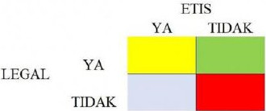
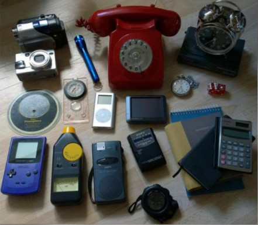
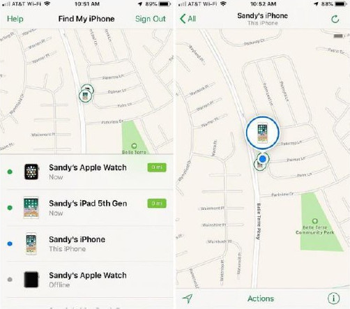

# Dampak Sistem Informasi pada Etika

Penggunaan sistem informasi berbasis komputer dapat menimbulkan beberapa hal yang negatif. Banyak juga penggunaan teknologi informasi yang masuk ke wilayah abu-abu atau tidak jelas benar salahnya, baik buruknya, dan yang sejenis. Kondisi ini dapat diakibatkan oleh pesatnya kemajuan teknologi informasi. Ketika suatu teknologi dikembangkan dan kemudian diadopsi secara luas seringkali tidak dipikirkan secara komprehensif dampaknya. Para penemu dan pengembang teknologi sering terlalu fokus pada pengembangan teknologi. Dalam pengembangannya, sering kali kajian terhadap dampak negatif tidak terlalu dalam dilakukan karena terbatasnya waktu. Para pengembang dikejar tenggat untuk segera menyelesaikan produk dan dipasarkan tanpa waktu yang memadai untuk kajian dampaknya secara menyeluruh.

## Daftar Isi

- [Dampak Sistem Informasi pada Etika](#dampak-sistem-informasi-pada-etika)
  - [Daftar Isi](#daftar-isi)
  - [Kasus Penyalahgunaan Teknologi Informasi](#kasus-penyalahgunaan-teknologi-informasi)
  - [Etika](#etika)
  - [Perkembangan Teknologi Informasi dan Dimensi Moral](#perkembangan-teknologi-informasi-dan-dimensi-moral)
  - [Tren Teknologi dan Dampaknya](#tren-teknologi-dan-dampaknya)
  - [Etika dalam membuat keputusan](#etika-dalam-membuat-keputusan)
  - [Prinsip Etika](#prinsip-etika)
  - [Asosiasi yang merumuskan kode etik](#asosiasi-yang-merumuskan-kode-etik)
  - [Rangkuman](#rangkuman)

## Kasus Penyalahgunaan Teknologi Informasi

Teknologi informasi sebagai suatu ciptaan manusia sebenarnya bersifat netral. Hanya saja ketika teknologi informasi digunakan oleh pihak-pihak yang tidak bertanggung jawab atau hanya digunakan bagi mengejar keuntungan sesaat maka dampak negatif akan muncul. Berikut contoh beberapa kasus yang melibatkan penyalahgunaan teknologi informasi:

1. Produsen mobil Volkswagen dari Jerman mencurangi uji emisi kendaraan bermotor diesel di Amerika Serikat1. Software pengendali mobil yang ada di beberapa jenis mobil Volkswagen bermesin diesel yang dijual di Amerika Serikat memiliki perangkat lunak khusus. Sensor pada mobil tersebut dapat mengetahui jika mobil sedang menjalani uji emisi. Jika sensor mendeteksi uji emisi berlangsung, maka komputer mobil akan menggunakan setelan mesin ramah lingkungan. Dengan setelan mesin tersebut, mobil Volkswagen dapat memenuhi ambang batas uji emisi di Amerika Serikat. Ketika mobil digunakan di jalan raya biasa, maka setelan mobil akan beralih ke setelan normal yang tidak memenuhi ambang batas emisi di Amerika Serikat. Penyimpangan ini dilakukan atas sepengetahuan pihak manajemen puncak Volkswagen. Atas pelanggaran ini Volkswagen didenda US$ 14,7 Milyar dan harus mengganti perangkat lunak pada hampir 50 ribu mobil bermesin diesel.
2. Citibank, Barclays, JP Morgan Chase, MUFG, dan Royal Bank of Scotland (RBS) memanipulasi suku bunga LIBOR (London Interbank Offered Rate) guna memanipulasi pasar keuangan2. LIBOR adalah suku bunga acuan untuk pinjaman antar institusi keuangan dunia. Kelima lembaga keuangan kelas dunia tersebut melakukan kolusi untuk memanipulasi suku bunga acuan LIBOR. Departemen Kehakiman Amerika Serikat melakukan penyelidikan dan menyatakan kelima lembaga tersebut bersalah. Otoritas Uni Eropa mendenda kelima lembaga tersebut dengan jumlah total US$ 1,2 milyar.
3. Enron Corporation di masa jayanya adalah salah satu perusahaan publik di bidang energi terbesar di dunia (McLean & Elkind, 2003). Enron mempekerjakan lebih dari 29.000 karyawan dengan pendapatan sekitar US$ 101 milyar di tahun 2000. Enron juga dinobatkan sebagai perusahaan Amerika Serikat paling inovatif oleh Majalah Fortune selama enam tahun berturut-turut. Di tahun 2001 terungkap bahwa selama bertahun-tahun pihak manajemen Enron melakukan upaya manipulasi laporan keuangan. Laporan keuangan yang dimanipulasi tersebut menunjukkan bahwa posisi keuanagn Enron tidak hanya sehat namun juga bertumbuh secara signifikan. Manipulasi ini digunakan untuk menipu para investor. Para petinggi Enron mengambil keuntungan dengan mendapat bonus berupa saham atas kinerja hebat mereka dan kemudian menjual saham tersebut. Pada akhirnya Enron dinyatakan bangkrut dan para pelaku manipulasi dipenjara. Tidak hanya Enron yang bangkrut, Arthur Andersen selaku auditor Enron juga bubar karena membiarkan praktek manipulasi laporan keuangan. Arthur Andersen juga memusnahkan barang bukti berupa 1 ton kertas kerja hasil audit Enron sebelum disita oleh pihak berwajib.

Berbagai pelanggaran yang dilakukan berbagai korporasi besar dunia tersebut menggunakan teknologi informasi sebagai salah satu alat manipulasi.

Tidak dipungkiri dalam menjalankan suatu usaha, para manajer seringkali dihadapkan pada berbagai aturan dan regulasi yang mungkin menghambat atau memperlambat. Para manajer sering melakukan tindakan dan membuat keputusan yang masuk ke wilayah abu-abu. Sering juga permasalahan yang dihadapi belum ada aturannya, sehingga para pelaku bisnis sering harus bertindak tanpa pedoman aturan atau regulasi yang jelas. Dalam situasi tersebut dibutuhkan etika bisnis.

## Etika

Etika didefinisikan sebagai prinsip tentang hal yang baik dan salah di mana prinsip tersebut digunakan oleh seseorang dengan kehendak bebas untuk membuat keputusan dan membimbing perilakunya (Boylan, 2014; Brooks & Dunn, 2018). Seseorang berkehendak bebas berarti orang tersebut dalam berperilaku tidak dipaksa atau di bawah tekanan. Etika sering kali berbeda dengan legalitas sesuai aturan atau hukum tertulis. Kita dapat melihatnya dalam gambar 3.1 berikut.

Gambar 3.1
Posisi Legalitas dan Etika

Idealnya setiap keputusan dan perilaku masuk ke bidang yang memenuhi secara legal dan etika. Namun kadang kita harus melanggar salah satu demi melakukan suatu tindakan atau membuat keputusan. Bidang merah tentunya adalah yang dihindari, yaitu keputusan atau perilaku yang melanggar hukum dan tidak etis.

Sistem informasi berbasis komputer membawa perubahan yang terkadang cukup drastis (Mumford, 1996). Perubahan drastis tersebut kerap membawa perubahan tatanan sosial, ekonomi, politik, dan budaya. Perubahan tersebut kerap juga mengubah struktur kekuasaan, wewenang, dan pembuatan keputusan. Perubahan tersebut juga menyebabkan pola pengawasan dan pengendalian karyawan berubah. Jika personel yang mendapat pelimpahan wewenang dan tidak diawasi secara ketat, maka terbuka peluang untuk melakukan tindakan negatif jika etika orang tersebut lemah.

## Perkembangan Teknologi Informasi dan Dimensi Moral

Perkembangan teknologi informasi seperti Internet, perangkat telekomunikasi bergerak, perdagangan elektronik dan lainnya membawa permasalahan etika baru. Kemudahan untuk mengumpulkan, menyimpan, dan mengolah data konsumen dapat membuka peluang penyalahgunaan data. Privasi para konsumen dapat terancam oleh teknologi baru. Selain itu muncul pula permasalahan pada hak atas kekayaan intelektual. Mudahnya menggandakan dan mendistribusikan data digital membuat pelanggaran hak atas kekayaan intelektual jauh lebih mudah.

Dilema etis yang sering dihadapi para manajer dalam membuat keputusan seringkali merupakan cerminan dilema yang dihadapi masyarakat secara luas (Boylan, 2014; Stuart, Stuart, & Pedersen, 2014). Perubahan yang dibawa teknologi informasi baru seringkali belum diatur oleh regulasi yang ada. Masyarakat sebagai suatu komunitas sosial juga membutuhkan waktu untuk menanggapi sebuah perubahan. Tanggapan berupa kesepakatan, aturan, dan undang-undang membutuhkan waktu untuk dibentuk dan disosialisasikan. Ada lima dimensi moral yang terpengaruh oleh perubahan yang dibawa teknologi informasi baru, yaitu (Laudon & Laudon, 2018):

1. Hak dan kewajiban atas informasi untuk tiap individu dan organisasi. Bagaimana informasi rahasia seseorang dapat dilindungi?
2. Hak dan kewajiban atas kepemilikan terhadap sesuatu. Hal ini terkait dengan hak kepemilikan di era digital yang dengan mudah diabaikan.
3. Pengendalian dan akuntabilitas atas penggunaan informasi dan hak kepemilikan
4. Kualitas sistem informasi yang harus mampu melindungi masyarakat dan individu
5. Kualitas kehidupan terutama pada nilai dan budaya yang mungkin terpengaruh perkembangan teknologi

## Tren Teknologi dan Dampaknya

Pada tabel 3.1 berikut ini adalah tren perkembangan teknologi dan dampaknya bagi individu dan masyarakat:

Tabel 3.1
Tren Teknologi dan Dampaknya

| Tren                                                        | Dampak                                                                                                                                                                |
| ----------------------------------------------------------- | --------------------------------------------------------------------------------------------------------------------------------------------------------------------- |
| Kekuatan komputasi meningkat dua kali lipat setiap 18 bulan | Penggunaan komputer semakin meluas dan ketergantungan pada komputer semakin meningkat. Jika sistem komputer terganggu banyak aspek kehidupan kita juga akan terganggu |
| Ongkos penyimpanan data menurun secara cepat                | Data terperinci setiap konsumen dapat disimpan dengan mudah dan dalam jangka waktu lama. Data apa saja dapat dikumpulkan dan disimpan                                 |
| Kemajuan analisis data                                      | Data individual yang dikumpulkan secara terperinci mudah dianalisa untuk mendapatkan informasi yang mungkin sensitif                                                  |
| Kemajuan di bidang jaringan telekomunikasi                  | Data dengan mudah dipindahkan dari satu lokasi ke lokasi lain. Pengendalian dan kedaulatan atas data menjadi lebih sulit ditegakkan                                   |
| Pertumbungan perangkat telekomunikasi bergerak              | Telepon milik individu tertentu dapat dengan mudah dilacak keberadaannya dan diikuti                                                                                  |

Kekuatan komputasi yang bertumbuh dua kali lipat setiap 18 bulan memungkinkan dikembangkannya aplikasi pengolahan data baru. Data yang dulunya tidak dapat dianalisis dengan komputer sekarang dapat dianalisis dengan mudah. Kapasitas pengolahan data juga meningkat pesat. Dengan demikian penggunaan komputer semakin ekstensif dan intensif. Semakin banyak aspek kehidupan kita yang tergantung pada sistem informasi berbasis komputer. Gangguan pada sistem informasi berbasis komputer dapat menciptakan kondisi yang merugikan. Regulasi mengenai kehandalan dan akurasi sistem informasi berbasis komputer belum seragam dan bahkan belum tentu ada.

Menurunnya ongkos untuk menyimpan data berarti semakin banyak data dapat disimpan. Berbagai organisasi dapat menyimpan data yang semakin lengkap mengenai berbagai aspek kegiatan mereka termasuk data individual. Jika dulu perusahaan eceran hanya menyimpan data mengenai transaksi, maka sekarang marketplace seperti Tokopedia, Buka Lapak, Shopee, dan lainnya mulai menyimpan data interaksi. Begitu seorang pengguna mengunjungi situs web atau membuka aplikasi belanja saat itulah data mulai dikumpulkan. Mulai dari data perangkat yang digunakan untuk mengakses, waktu akses, lokasi akses, sampai nanti kategori produk apa saja yang dilihat sebelum kemudian terjadi transaksi. Melanggar privasi individu menjadi semakin mudah dan murah.

Kemajuan dalam teknik analisis data juga memungkinkan berbagai data yang tadinya tidak dapat diolah dengan komputer menjadi mudah diolah dengan komputer. Berbagai analisis terhadap data interaksi konsumen seperti paragraf di atas dapat mengungkapkan informasi individu yang terperinci. Dengan menganalisis data aktivitas kita di media sosial, seseorang dapat menyusun profil psikologis kita dengan mudah. Di Amerika Serikat, bank dilarang menggunakan data kode pos bagi analisis kredit terhadap calon nasabah pinjaman. Kode pos mengungkapkan wilayah dan wilayah sering mengandung informasi kondisi sosial ekonomi. Keputusan memberikan pinjaman berdasarkan kondisi sosial ekonomi tempat tinggal dianggap diskriminasi oleh pemerintah Amerika Serikat.

Salah satu teknik analisis data yang cukup mengkuatirkan adalah Nonobvious Relationship Awareness atau disingkat NORA (Berger & Doban, 2014; Karakiewicz, Sun, & Azizi, 2014; Mayer-Schonberger & Cukier, 2014). Dengan NORA, data dari berbagai sumber yang berbeda dapat dikompilasi dan direkonsiliasi untuk menemukan berbagai hubungan antar data dan mengungkap profil lengkap si pemilik data. Biasanya NORA digunakan oleh aparat penegak hukum guna melawan kejahatan atau memerangi terorisme. Meskipun begitu, tidak tertutup kemungkinan NORA digunakan perusahaan swasta untuk menganalisa para konsumennya.

Kemajuan dalam teknologi telekomunikasi memungkinkan pertukaran data dilakukan dengan mudah, murah, dan cepat. Perkembangan itu juga mencakup perkembangan teknologi komunikasi seluler. Telepon genggam biasa sekarang dilengkapi dengan berbagai perangkat dan fasilitas tambahan yang menggantikan banyak perangkat, seperti nampak pada gambar 3.2.

Sumber: <https://www.themightyfeed.com/10-things-that-smartphones-have-replaced/>

Gambar 3.2
Perangkat yang Digantikan Telepon Pintar

Dengan menggunakan telepon pintar, seseorang dapat memotret atau merekam data yang sifatnya rahasia untuk kemudian dikirim melalui email atau pesan singkat ke pihak lain dengan cepat. Produsen telepon pintar sering juga menanamkan fasilitas pelacakan perangkat. Sebenarnya fasilitas ini dimaksudkan untuk melacak keberadaan perangkat jika hilang atau dicuri seperti nampak pada gambar 3.3. Fasilitas ini dapat disalahgunakan untuk mengetahui keberadaan individu oleh pihak-pihak yang tidak bertanggung jawab.

Sumber: <https://www.idownloadblog.com/2014/08/07/how-to-track-lost-stolen-iphone-ipad-find-my-iphone/>

Gambar 3.3
Fasilitas Menemukan Lokasi iPhone dari Apple

## Etika dalam membuat keputusan

Perlu disadari bahwa etika berkaitan dengan manusia yang memiliki kebebasan dalam menentukan pilihan atau tindakan. Etika berperan dalam membantu manusia membuat keputusan ketika ada beberapa alternatif yang dapat dipilih. Ketika membuat keputusan secara etis, maka manusia tersebut bertanggung jawab atas konsekuensi pilihannya (Dolgoff, Harrington, & Loewenberg, 2012; Sommers-Flanagan & Sommers-Flanagan, 2015).

Konsep dasar yang mendasari pembuatan keputusan etis ada tiga, yaitu tanggung jawab, akuntabilitas, dan liabilitas (Boylan, 2014; Brooks & Dunn, 2018). Tanggung jawab berarti pembuat keputusan siap menanggung akibat yang mungkin terjadi atas keputusan yang dibuatnya. Akuntabilitas adalah mekanisme yang menentukan siapa yang bertindak dan siapa yang bertanggung jawab atas suatu tindakan. Liabilitas adalah perpanjangan konsep bertanggung jawab dalam ranah legal. Liabilitas adalah aturan yang memungkinkan orang yang dirugikan oleh suatu tindakan (baik oleh individu, sistem, maupun organisasi) untuk mendapatkan kompensasi yang layak. Ketiga konsep tersebut harus sejalan dengan proses hukum yang terjamin kepastiannya.

Ketika seseorang dihadapkan pada kondisi harus membuat keputusan etis, biasanya akan muncul dilema etika. Dilema etika adalahmasalah pengambilan keputusan antara dua keharusan moral yang mungkin terjadi dan semua alternatif keputusan tidak dapat diterimaatau lebih disukai (Dolgoff et al., 2012; Stuart et al., 2014). Untuk menganalisa situasi dan membuat keputusan dalam dilema etika, maka dapat diambil langkah-langkah berikut:

1. Mengidentifikasi fakta dengan jelas
   Ketika muncul masalah, sangat perlu untuk mendapatkan kejelasan dan fakta, bukan hanya dari satu sisi saja. Seringkali informasi pertama yang didapatkan mengandung bias yang cenderung memihak salah satu pihak. Fakta tentang siapa yang berbuat, apa yang diperbuat, apa dampaknya, waktu kejadian, lokasi, kejadian, dan lainnya perlu diketahui.
2. Mengidentifikasi konflik atau dilema etika yang terjadi
   Dalam suatu konflik, tiap pihak yang terlibat akan memiliki argumen bahwa mereka menjunjung tinggi nilai-nilai tertentu sebagai dasar tindakannya. Maka sebelum membuat keputusan perlu diidentifikasi nilai-nilai yang berkonflik.
3. Mengidentifikasi para pemangku kepentingan
   Setiap peristiwa konflik pasti ada pemangku kepentingan atau para pihak yang memiliki kepentingan. Dalam merancang solusi, kepentingan tiap pihak ini harus dipertimbangkan dan jika memungkinkan diakomodasi.
4. Mengidentifikasi alternatif keputusan yang dapat dipilih
   Biasanya dalam situasi harus membuat keputusan, akan ada beberapa alternatif yang dapat dipilih. Tiap alternatif tidak mungkin memuaskan semua pihak yang berkepentingan. Yang perlu dilakukan adalah mengidentifikasi alternatif yang terbaik dalam situasi yang dihadapi.
5. Mengidentifikasi potensi konsekuensi dari tiap pilihan
   Sebagai pembuat keputusan perlu untuk menyadari dampak dari tiap alternatif. Tiap alternatif pasti akan membawa konsekuensi ada pemangku kepentingan yang dirugikan.

## Prinsip Etika

Setelah melakukan analisa etika, maka tiba saatnya untuk membuat keputusan dengan cara memilih alternatif yang terbaik dalam situasi yang dihadapi. Ada beberapa prinsip etika yang dapat membantu dalam memilih alternatif terbaik, yaitu (Boylan, 2014; Brooks & Dunn, 2018; Dolgoff et al., 2012; Sommers-Flanagan & Sommers-Flanagan, 2015; Stuart et al., 2014):

1. _Golden Rule_ yang bermakna memperlakukan orang lain seperti kita ingin diperlakukan. Dengan menempatkan diri kita pada posisi orang lain, kita dapat melihat apakah suatu tindakan sudah memenuhi rasa keadilan.
2. _Categorical Imperative_ yang bermakna jika suatu tindakan tidak layak dilakukan oleh semua orang, maka tindakan tersebut tidak layak dilakukan oleh seseorang.
3. Jika suatu tindakan tidak dapat dilakukan berulang kali, maka tidak selayaknya suatu tindakan dilakukan. Mungkin saja satu hal jika hanya dilakukan satu kali tidak berdampak negatif, tetapi jika dilakukan berulang kali maka akan membawa akumulasi dampak negatif. Maka, tindakan demikian sebaiknya tidak dilakukan sama sekali.
4. _Utilitarian Principle_ yang bermakna memilih tindakan yang merupakan tindakan dengan nilai moral tertinggi. Jika ada alternatif tindakan, maka dibuat ranking tindakan mana yang nilai moralnya tertinggi. Misalnya mencuri uang untuk mengobati keluarga yang sakit kritis. Nilai moral menyelamatkan nyawa manusia yang sakit kritis lebih tinggi daripada tidak mencuri.
5. Memilih tindakan yang menghasilkan kerugian paling minimal.
6. Dalam melakukan tindakan, kita berasumsi segala sesuatu yang ada (baik berwujud maupun tak berwujud) ada pemiliknya kecuali dinyatakan secara jelas tidak ada pemiliknya. Prinsip ini terkait dengan hak atas kekayaan intelektual.

## Asosiasi yang merumuskan kode etik

Beberapa asosiasi profesi berusaha untuk merumuskan kode etik bagi profesi mereka. Kode etik dimaksudkan sebagai panduan bagi anggota asosiasi profesi tersebut dalam melaksanakan profesinya. Di Indonesia terdapat berbagai kode etik profesi seperti misalnya Kode Etik Jurnalistik untuk profesi wartawan, Kode Etik Kedokteran untuk profesi dokter, dan lainnya. Pada profesi sistem informasi sendiri terdapat berbagai asosiasi profesi yang juga memiliki kode etik, seperti misalnya:

1. Association of Computing Machinery memiliki _Code of Ethics and Professional Conduct_ dan dapat dilihat di <https://www.acm.org/code-of-ethics>
2. Association of Information Systems memiliki _Code of Research Conduct_ dan dapat dilihat di <https://aisnet.org/page/AdmBullCResearchCond>
3. The Institute of Electrical and Electronics Engineers memiliki _Code of Ethics_ dan dapat dilihat di <https://www.ieee.org/about/corporate/governance/p7-8.html>

Dengan adanya kode etik, asosiasi profesi tersebut berusaha untuk menegakkan kode etik pada para anggotanya. Kode etik tersebut juga ditegakkan oleh asosiasi profesi. Dalam hal pelanggaran kode etik, maka penyelidikan dan sanksi diberikan oleh asosiasi profesi. Hal tersebut berguna jika pelanggaran etika belum diatur dengan regulasi dari pemerintah.

## Rangkuman

1. Etika adalah prinsip tentang hal yang baik dan salah di mana prinsip tersebut digunakan oleh seseorang dengan kehendak bebas untuk membuat keputusan dan membimbing perilakunya.
2. Etika sering kali berguna untuk menjadi pedoman dalam pembuatan keputusan ketika ada hal yang belum diatur oleh regulasi atau undang-undang yang berlaku.
3. Ada lima dimensi moral yang terpengaruh oleh perkembangan teknologi informasi, yaitu hak dan kewajiban atas informasi, hak dan kewajiban atas kepemilikan, pengendalian dan akuntabilitas, kualitas sistem informasi, dan kualitas kehidupan.
4. Dilema etika adalah masalah pengambilan keputusan antara dua keharusan moral yang mungkin terjadi dan semua alternatif keputusan tidak dapat diterima atau lebih disukai.
5. Untuk mengatasi dilema etika perlu dilakukan analisa etika yang kemudian berdasarkan prinsip etika yang dianut, dibuatlah keputusan.

---

Selanjutnya [Kegiatan Belajar 2: Dampak Teknologi Informasi pada Individu](kb-02.md)
