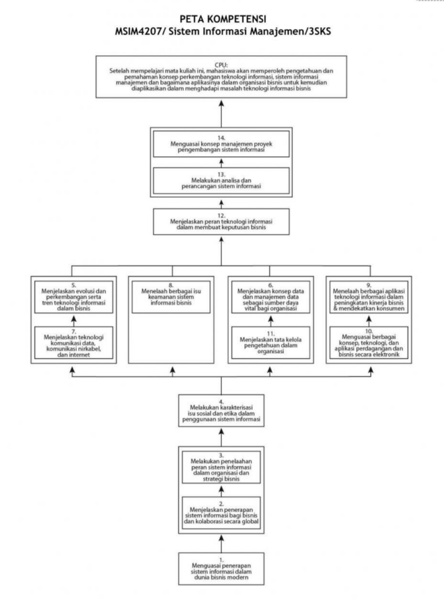

# MSIM4207

Sistem Informasi Manajemen

## Tinjauan

Perkembangan teknologi yang begitu cepat disertai kebutuhan yang semakin meningkat akan perangkat teknologi informasi menimbulkan tantangan baru. Pelaku bisnis perlu memahami kelebihan dan kelemahan teknologi informasi yang ada di pasaran serta bagaimana mengoptimalkan investasi usaha. Aktivitas mengetahui, mengevaluasi, dan memilih opsi solusi teknologi informasi yang cepat dan tepat bagi bisnis menuntut para pelaku memiliki pengetahuan yang cukup tentang konsep dan prinsip sistem informasi manajemen dan dapat mengaplikasikan dalam proses bisnis.

Secara rinci, konsep dan prinsip sistem informasi manajemen yang akan Anda pelajari dalam mata kuliah ini meliputi:

1. Penerapan sistem informasi dalam dunia bisnis modern guna meningkatkan daya saing dan kolaborasi
2. Pemanfaatan sistem informasi dalam organisasi dan strategi bisnis
3. Berbagai isu sosial dan etika dalam penggunaan teknologi informasi
4. Evolusi dan perkembangan serta tren teknologi informasi dalam bisnis, seperti teknologi telekomunikasi, manajemen data, keamanan, dan aplikasinya dalam bisnis
5. Berbagai konsep, teknologi, dan aplikasi perdagangan dan bisnis secara elektronik
6. Tata kelola pengetahuan dalam organisasi
7. Analisa dan perancangan sistem informasi maupun manajemen proyek pengembangan sistem informasi

Ketujuh konsep di atas saling terkait satu sama lain, sehingga Anda harus mempelajarinya secara sistematis dan komprehensif, guna mendapatkan pemahaman yang utuh mengenai tata kelola fungsi sistem informasi. Perkembangan teknologi yang cepat akan membuat contoh-contoh di dalam materi segera tertinggal dan mungkin tidak lagi relevan, namun prinsip dan konsep tata kelola masih akan relevan meski teknologi berubah. Dengan mempelajari semua materi mata kuliah ini dengan seksama, capaian pembelajaran umum yang akan Anda raih adalah mampu menerapkan konsep dasar, prinsip, dan aplikasi teknologi informasi dalam menemukan solusi bisnis yang tepat secara cepat.  

## Susunan

Untuk mempermudah Anda mempelajari materi tersebut, buku materi pokok ini dikemas dalam 9 (sembilan) modul dengan susunan sebagai berikut.

- [Modul 1.  Sistem Informasi dalam Bisnis](M1/README.md)
- [Modul 2.  Sistem Informasi untuk Bisnis: Kolaborasi dan Strategi](M2/README.md)
- Modul 3.  Permasalan Sosial dan Etika pada Sistem Informasi
- Modul 4.  Infrastruktur Teknologi Informasi
- Modul 5.  Keamanan Sistem Informasi
- Modul 6.  Manajemen Data dan Pengetahuan
- Modul 7.  Aplikasi dan Implementasi Sistem Informasi dalam Bisnis.
- Modul 8.  Peran Sistem Informasi dalam Pembuatan Keputusan Bisnis
- Modul 9.  Pengembangan Sistem Informasi

Sistematika dan ruang lingkup materi yang dibahas dalam mata kuliah sistem informasi manajemen ini dapat Anda lihat pada peta kompetensi mata kuliah berikut.

## Peta Kompetensi

