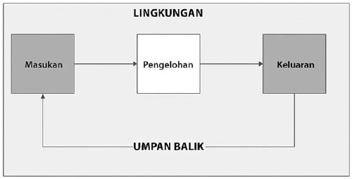
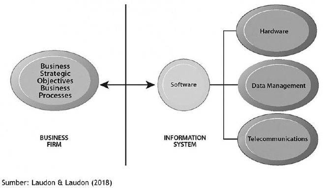

# Pengertian Sistem Informasi

Peran besar sistem dan teknologi informasi dalam bisnis modern tidak dapat diabaikan. Sebagai permulaan akan dibahas mengenai pengertian dasar sistem informasi dan teknologi informasi, kemudian dilanjutkan dengan pembahasan mengenai komponen sistem informasi.

## Daftar Isi

- [Pengertian Sistem Informasi](#pengertian-sistem-informasi)
  - [Daftar Isi](#daftar-isi)
  - [Sistem Informasi](#sistem-informasi)
    - [Subsistem, Sistem, dan Supra Sistem](#subsistem-sistem-dan-supra-sistem)
    - [Cara Kerja Sistem Mengolah Informasi](#cara-kerja-sistem-mengolah-informasi)
    - [Tipe Sistem Informasi](#tipe-sistem-informasi)
  - [Teknologi Informasi](#teknologi-informasi)
  - [Dimensi Organisasi](#dimensi-organisasi)
    - [Hierarki Organisasi](#hierarki-organisasi)
  - [Tata Kerja Organisasi](#tata-kerja-organisasi)
  - [Budaya Organisasi](#budaya-organisasi)
  - [Dimensi Manajemen](#dimensi-manajemen)
  - [Dimensi Teknologi](#dimensi-teknologi)
    - [Komponen Teknologi Informasi](#komponen-teknologi-informasi)
  - [Investasi Sistem dan Teknologi Informasi](#investasi-sistem-dan-teknologi-informasi)
  - [Rangkuman](#rangkuman)

## Sistem Informasi

**Sistem** adalah sekumpulan komponen yang saling berinteraksi dan bekerja sama untuk mencapai tujuan yang sama (Bertalanffy, 1971; Checkland, 1981). Kata kuncinya adalah sekumpulan komponen atau subsistem, sehingga suatu sistem terdiri dari beberapa subsistem dan demikian juga sebaliknya. Komponen atau subsistem penyusun suatu sistem berinteraksi dan bekerja sama satu dengan yang lain. Suatu sistem juga memiliki tujuan yang menjadi dasar kerja sistem tersebut. Beberapa subsistem akan membentuk sistem, dan kemudian beberapa sistem akan membentuk supra sistem.

### Subsistem, Sistem, dan Supra Sistem

Gambar 1.1
Subsistem, Sistem, dan Supra Sistem

**Informasi** adalah data yang sudah mengalami pengolahan sedemikian rupa sehingga dapat digunakan oleh penggunanya dalam membuat keputusan (Laudon & Laudon, 2018; Rainer, Prince, & Watson, 2013; Romney & Steinbart, 2014). Setiap pembuatan keputusan yang rasional membutuhkan informasi yang memadai sehingga memperoleh hasil yang optimal dalam kondisi pada saat keputusan tersebut dibuat.
**Sistem informasi** sendiri didefinisikan sebagai suatu sistem yang digunakan untuk mengumpulkan, mengolah, menyimpan, dan mendistribusikan informasi (Laudon & Laudon, 2018). Informasi tersebut akan digunakan untuk mendukung tata kelola suatu organisasi.
**Teknologi informasi** didefinisikan sebagai perangkat komputer yang digunakan untuk menyimpan, mengambil, mengirimkan, dan mengolah data (Turban, Pollard, & Wood, 2018). Pengolahan data menjadi informasi merupakan inti kegiatan setiap sistem informasi. Data dimasukkan (input), diolah (proses), dan menjadi informasi (output). Dalam proses pengolahan tersebut terdapat mekanisme pengendalian (kontrol) berupa umpan balik untuk memastikan pengolahan data menjadi informasi sesuai dengan tujuan organisasi.

### Cara Kerja Sistem Mengolah Informasi

Gambar 1.2
Cara Kerja Sistem Mengolah Informasi

### Tipe Sistem Informasi

Tabel 1.1 menunjukkan berbagai tipe sistem informasi dan penggunaannya oleh hirarki organisasi.

Tabel 1.1
Berbagai Tipe Sistem Informasi

| Tipe                        | Karakteristik                                                                                                                                                                                                                            |
| --------------------------- | ---------------------------------------------------------------------------------------------------------------------------------------------------------------------------------------------------------------------------------------- |
| Sistem Pemrosesan Transaksi | Digunakan oleh personil operasional, Menghasilkan informasi yang menjadi masukan bagi sistem lain, Menggunakan data internal dan eksternal, Berorientasi pada efisiensi.                                                                 |
| Sistem Informasi Manajemen  | Digunakan manajemen tingkat bawah dan menengah, Berdasarkan informasi internal, Mendukung pembuatan keputusan terstruktur, Tidak fleksibel, Kurang kemampuan analisa data, Fokus pada data masa lalu dan saat ini.                       |
| Sistem Pendukung Keputusan  | Digunakan oleh manajemen senior, Mendukung pembuatan keputusan semi terstruktur dan tidak terstruktur, Memiliki fasilitas pemodelan lanjut, Menggunakan data internal dan eksternal serta masukan dari pengguna, Memprediksi masa depan. |
| Sistem Informasi Eksektutif | Digunakan pimpinan puncak organisasi, Mudah digunakan, Mendukung pembuatan keputusan tidak terstruktur, Menggunakan sumber data internal dan eksternal, Berfokus pada efektivitas perusahaan, Sangat fleksibel Berfokus pada masa depan, |

## Teknologi Informasi

Aspek lain dari sistem informasi tentunya adalah teknologi informasi. Teknologi informasi yang akan dibutuhkan dalam pengelolaan suatu sistem informasi meliputi (Laudon & Laudon, 2018):

1. Perangkat keras komputer
2. Perangkat lunak komputer
3. Teknologi pengelolaan dan penyimpanan data
4. Teknologi jaringan dan telekomunikasi data

Keseluruhan teknologi tersebut beserta manusia dan rangkaian proses dan prosedur merupakan suatu sumber daya bagi organisasi. Teknologi informasi merupakan dasar bagi pengembangan sistem informasi suatu organisasi. Selain aspek teknologi, sistem informasi juga memiliki aspek non teknologi, yaitu prosedur atau proses dan manusia (Turban et al., 2018).

## Dimensi Organisasi

Dapat disimpulkan bahwa suatu sistem informasi dalam organisasi memiliki beberapa dimensi yang berbeda. Dimensi tersebut berupa organisasi, teknologi, dan manajemen (Laudon & Laudon, 2018). Dimensi organisasi merujuk pada struktur dan hirarki organisasi. Pada umumnya suatu organisasi memiliki tiga level manajemen dengan tugas yang berbeda, yaitu (Stoner, 1994):

1. manajemen senior yang bertanggung jawab untuk menentukan arah organisasi. Keputusan yang dibuat bersifat jangka panjang, mempengaruhi keseluruhan organisasi, dan berdampak besar.
2. manajemen menengah yang bertanggung jawab untuk menjalankan dan menerjemahkan strategi serta kebijakan dari manajemen senior.
3. manajemen operasional yang bertanggung jawab untuk mengelola operasi rutin harian suatu organisasi.

### Hierarki Organisasi

Gambar 1.3
Hierarki Organisasi

## Tata Kerja Organisasi

Perkembangan teknologi mengakibatkan munculnya ragam baru pekerjaan dalam organisasi. Pada organisasi konvensional terdapat karyawan yang bertanggung jawab untuk menghasilkan barang atau jasa untuk dijual kepada konsumen. Golongan lain adalah karyawan yang mengurusi administrasi. Pada saat ini karyawan administrasi menjadi pekerja pengetahuan (knowledge workers) dan pekerja data (data workers). Kedua jenis pekerja ini meningkatkan dan mengubah peran karyawan administrasi dari sekedar pendukung menjadi bagian penting untuk membantu tata kelola perusahaan (Turban et al., 2018).

Tiap organisasi juga memiliki berbagai area fungsional. Tiap area fungsional memiliki fungsi spesifik yang berbeda-beda. Area fungsional tersebut adalah penjualan dan pemasaran, produksi dan operasi, keuangan dan akuntansi, dan sumber daya manusia (Romney & Steinbart, 2014).

Tata kerja organisasi dikelola dan dikoordinasikan menggunakan struktur dan hirarki organisasi. Kegiatan suatu organisasi diwujudkan dalam bentuk proses bisnis. Proses bisnis adalah regulasi yang dikembangkan oleh suatu organisasi untuk menyelesaikan atau melaksanakan suatu tugas (Parkes, Blount, Considine, & Olesone, 2016). Proses bisnis dikembangkan dan disempurnakan seiring berjalannya waktu. Proses bisnis memandu para karyawan untuk melakukan tugasnya, seperti misalnya membuat faktur, menangani keluhan pelanggan, mengirimkan pesanan, dan lain sebagainya. Ada proses bisnis yang telah ditulis dan dilaksanakan secara ketat, ada pula proses bisnis yang berupa kebiasaan informal yang telah lama dilakukan oleh suatu perusahaan.

## Budaya Organisasi

Setiap organisasi memiliki budaya organisasi yang unik. Budaya organisasi adalah sekumpulan asumsi, tata nilai, dan cara untuk melakukan suatu pekerjaan yang diterima oleh sebagian besar anggota organisasi tersebut (Hofstede, 1997; Kleiner, 2000). Budaya organisasi sering sekali dapat dirasakan pada kehidupan suatu organisasi. Misalnya kita dapat melihat di perusahaan kecil komunikasi antar karyawan biasanya bersifat akrab, kekeluargaan, dan informal sedangkan komunikasi antar karyawan di perusahaan besar bersifat lebih formal dan resmi.

## Dimensi Manajemen

Dimensi manajemen dalam sistem informasi merujuk pada para pihak yang mendapat mandat untuk mengelola suatu organisasi. Manajemen memiliki empat fungsi utama, yaitu (Stoner, 1994):

1. perencanaan, di mana para manajer menetapkan arah, sasaran, dan tujuan organisasi, kemudian dibuatlah rencana untuk mencapainya.
2. pengorganisasian, di mana para manajer berusaha untuk mengalokasikan sumber daya yang dimiliki untuk merealisasikan rencana yang telah disusun demi pencapaian tujuan organisasi.
3. pengarahan, di mana para manajer mengarahkan para anak buahnya untuk bekerja mencapai tujuan organisasi dengan menggunakan sumber daya yang dimiliki secara efektif dan efisien.
4. pengendalian, di mana para manajer mengarahkan supaya jalannya organisasi tidak melenceng dari pencapaian tujuan organisasi.

Para manajer modern saat ini dituntut tidak hanya menjalankan apa yang telah ada pada suatu organisasi, namun para manajer juga dituntut untuk menciptakan peluang baru bagi organisasi. Peluang baru ini berupa produk baru, layanan baru, proses bisnis baru, dan jika diperlukan upaya reorganisasi. Para manajer dituntut untuk berpikir dan bertindak kreatif dan inovatif, tetapi tetap ada dalam koridor etika bisnis yang baik.

## Dimensi Teknologi

Dimensi teknologi informasi merujuk pada alat yang digunakan oleh manajer untuk menghadapi dan mengantisipasi perubahan dalam lingkungan bisnis. Komponen teknologi informasi adalah (Laudon & Laudon, 2018; Turban et al., 2018):

1. Perangkat keras komputer adalah perangkat fisik yang digunakan untuk pengolahan data menjadi informasi. Perangkat keras komputer dewasa ini terdiri dari komputer meja (desktop), komputer jinjing (laptop atau notebook), mesin pencetak, mesin pelarik citra, dan lainnya. Belakangan ukuran perangkat komputasi dapat diperkecil dan semakin mudah dibawa dalam bentuk telepon pintar dan komputer tablet. Perkembangan teknologi Internet of Things (IoT) membawa perangkat keras komputasi ke dalam barang yang lazimnya bukan merupakan komputer, seperti mesin pendingin ruangan, jam tangan, sepatu, dan lainnya.
2. Perangkat lunak komputer adalah kumpulan instruksi yang digunakan untuk mengendalikan dan mengkoordinasikan perangkat keras komputer untuk melakukan suatu pekerjaan tertentu.
3. Teknologi pengelolaan data adalah perangkat lunak komputer yang secara khusus ditujukan guna mengelola data di dalam media penyimpanan fisik.
4. Teknologi jaringan dan telekomunikasi data terdiri dari perangkat fisik dan perangkat lunak yang digunakan mentransfer data dari satu lokasi fisik ke lokasi fisik lainnya. Jaringan komputer memungkinkan berbagai perangkat saling berbagi data dan sumber daya komputasi lainnya. Internet adalah salah satu contoh jaringan komputer yang dipakai secara meluas di seluruh dunia.
5. Prosedur atau proses merupakan panduan tertulis yang mengarahkan bagaimana suatu sistem informasi beserta teknologi didalamnya digunakan. Seringkali, mengabaikan prosedur atau proses menjadi pangkal masalah. Sebagai contoh prosedur bahwa password harus diganti secara berkala tidak diikuti, maka mungkin saja password tersebut dapat diketahui pihak yang tidak bertanggung jawab dan disalahgunakan.
6. Manusia merupakan faktor terpenting dalam setiap sistem informasi. Manusia merupakan pengembang, pengelola, dan pengguna sistem informasi. Namun, manusia juga merupakan titik terlemah suatu sistem informasi. Banyak masalah dalam berbagai sistem informasi ternyata bersumber dari kelalaian manusia.

### Komponen Teknologi Informasi

Gambar 1.4
Komponen Teknologi Informasi

## Investasi Sistem dan Teknologi Informasi

Keseluruhan investasi pada sistem dan teknologi informasi tidak menjamin keberhasilan suatu perusahaan. Tanpa tata kelola yang tepat, maka investasi besar pada sistem dan teknologi informasi akan menjadi sia-sia. Sistem informasi adalah alat untuk menghasilkan nilai lebih pada suatu usaha. Untuk mencapai hasil yang memuaskan, maka investasi sistem informasi harus dibarengi tata kelola yang baik.

Banyak investasi pada sistem informasi gagal mencapai nilai imbal balik yang memuaskan. Hal tersebut disebabkan oleh investasi sistem informasi tidak disertai dengan investasi pelengkap yang dibutuhkan (Peppard & Ward, 2005; J. Ward, Daniel, & Peppard, 2008; J. L. Ward & Peppard, 2002). Investasi pelengkap yang dimaksud adalah investasi pada hal-hal yang dibutuhkan untuk menghasilkan nilai investasi pada sistem informasi.

Investasi pelengkap yang dibutuhkan adalah investasi pada modal dasar organisasi. Modal dasar organisasi terdiri dari aset organisasi (model bisnis yang tepat, proses bisnis yang efisien, dan pengembangan sistem informasi yang baik), aset manajerial (manajemen yang kuat, kerja sama, pelatihan, budaya manajemen yang mendorong kemajuan), dan aset sosial (misalnya infrastruktur, edukasi, standar industri, aturan perundang-undangan). Penelitian menunjukkan bahwa perusahaan yang melakukan investasi pelengkap secara memadai akan mencapai imbal hasil yang memuaskan (Anderson, Banker, & Ravindran, 2006; Bannister, 2001; Byrne et al., 2010; Cao, 2010). Tabel 1.2 menunjukkan daftar investasi pelengkap pada bidang organisasi dan manajemen (Laudon & Laudon, 2018).

## Rangkuman

1. Sistem informasi adalah suatu sistem yang digunakan untuk mengumpulkan, mengolah, menyimpan, dan mendistribusikan informasi.
2. Berbagai sistem informasi dapat digunakan oleh suatu organisasi berdasarkan hierarki dan struktur organisasinya. Ada sistem informasi yang digunakan oleh karyawan operasional, manajer tingkat bawah, manajer tingkat menengah, dan manajer puncak. Tiap tingkatan memiliki karakteristik yang disesuaikan dengan jenis pekerjaan dan tipe keputusan yang dibuat.
3. Aspek suatu sistem informasi meliputi teknologi informasi (perangkat keras komputer, perangkat lunak komputer, penyimpanan data, dan perangkat telekomunikasi), manusia, dan proses.
4. Investasi teknologi informasi tidak akan berhasil jika tidak disertai investasi pada aset pelengkap yang dibutuhkan guna merealisasikan nilai investasi tersebut. Aset pelengkap tersebut terdiri atas aset organisasi, aset manajerial, dan aset sosial.

***

Selanjutnya [Kegiatan Belajar 2: Peran Sistem Informasi dalam Transformasi Bisnis](kb-02.md)
