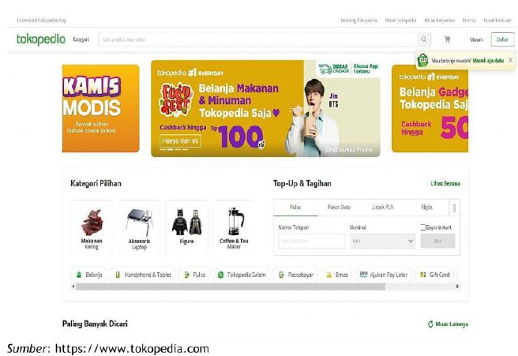
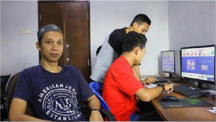

# Peran Sistem Informasi dalam Transformasi Bisnis

Perubahan dalam dunia usaha belakangan ini banyak dimotori oleh perkembangan teknologi informasi. Kemunculan beberapa pemain besar di perusahaan start-up berkelas unicorn2 seperti Gojek, Tokopedia, Traveloka, dan lainnya tidak lepas dari peran teknologi. Ambil contoh Gojek yang menggunakan model usaha seperti Uber, yaitu memanfaatkan telepon pintar sebagai alat usaha transportasi. Pada bagian ini, kita akan melihat secara garis besar bagaimana teknologi mengubah wajah bisnis di dunia.

## Daftar Isi

- [Peran Sistem Informasi dalam Transformasi Bisnis](#peran-sistem-informasi-dalam-transformasi-bisnis)
  - [Daftar Isi](#daftar-isi)
  - [Perkembangan teknologi informasi mendorong perubahan dalam bisnis](#perkembangan-teknologi-informasi-mendorong-perubahan-dalam-bisnis)
    - [Inovasi dalam bidang teknologi informasi](#inovasi-dalam-bidang-teknologi-informasi)
    - [Model usaha baru](#model-usaha-baru)
    - [Ekspansi perdagangan secara elektronik](#ekspansi-perdagangan-secara-elektronik)
    - [Perubahan tata kelola bisnis](#perubahan-tata-kelola-bisnis)
    - [Perubahan pada perusahaan dan organisasi](#perubahan-pada-perusahaan-dan-organisasi)
  - [Globalisasi Bisnis](#globalisasi-bisnis)
  - [Perkembangan Teknologi dan Internet](#perkembangan-teknologi-dan-internet)
  - [Peran Sistem Informasi](#peran-sistem-informasi)
  - [Perkembangan Teknologi Informasi Mengubah Industri](#perkembangan-teknologi-informasi-mengubah-industri)
  - [Tantangan Manajer Modern](#tantangan-manajer-modern)
  - [Trend Teknologi yang Mendorong Perubahan](#trend-teknologi-yang-mendorong-perubahan)
  - [Rangkuman](#rangkuman)

## Perkembangan teknologi informasi mendorong perubahan dalam bisnis

Perkembangan teknologi informasi yang pesat belakangan ini mendorong terjadinya beberapa perubahan penting dalam bisnis, yaitu (Laudon & Laudon, 2018):

### Inovasi dalam bidang teknologi informasi

Munculnya berbagai teknologi yang mengubah peta usaha dunia. Mulai dari komputasi awan (cloud computing) yang mengubah cara memperhitungkan investasi teknologi informasi sampai dengan big data yang mengubah cara perusahaan mengumpulkan, mengolah, dan menginterpretasikan informasi dalam skala masif. Perkembangan teknologi ini mendorong munculnya inovasi dalam bisnis. Tokopedia misalnya, mampu memberikan peluang bagi pengusaha UMKM dan perorangan untuk berkiprah pada perdagangan secara elektronik tanpa harus memikirkan bagaimana membuat situs web, aplikasi untuk telepon seluler, mekanisme pembayaran, perlindungan terhadap penjual dan pembeli, pengiriman barang, dan lainnya. Semua hal tersebut dapat dicapai hanya menggunakan telepon pintar.

### Model usaha baru

Munculnya model usaha (business model) seperti layanan streaming music Spotify dan Joox, maupun layanan streaming film Netflix dan iFlix. Layanan streaming tersebut merupakan alternatif yang menarik bagi konsumen musik dan film maupun juga bagi para seniman yang terlibat dalam pembuatannya. Layanan streaming ini dapat mengurangi permasalahan pembajakan lagu dan film, karena lagu dan film yang diberikan adalah karya asli. Para seniman mendapatkan royalti ketika karya mereka dinikmati oleh konsumen. Pada saat yang sama para konsumen mengurangi kecenderungan membajak karya seni karena layanan streaming dapat dinikmati dengan harga yang relatif lebih murah atau bahkan gratis dengan kompensasi harus menerima iklan. Tanpa model usaha berbasis teknologi informasi, maka solusi ini tidak akan pernah terwujud. Layanan streaming ini juga menjadi penantang baru bagi bisnis penjualan kaset, CD (Compact Disc), VCD (Video Compact Disc), DVD (Digital Versatile Disc), dan media konvensional lainnya. Banyak toko musik tradisional bangkrut dan tutup karena kalah bersaing dengan layanan ini.

### Ekspansi perdagangan secara elektronik

Perdagangan elektronik (e-commerce) di Indonesia mencapai nilai penjualan Rp77 triliun di tahun 20183 dan diprediksi akan mencapai Rp900 triliun di tahun 2022.4. Perkembangan perdagangan secara elektronik ini mengubah peta usaha di dunia dan Indonesia tidak terkecuali. Pertumbuhan pesat perdagangan elektronik didorong oleh perkembangan teknologi telepon seluler pintar yang menjadi terjangkau oleh mayoritas masyarakat, membaiknya infrastruktur telekomunikasi dan infrastruktur pembayaran, serta perbaikan di sisi regulasi yang memberikan kepastian hukum pada kegiatan perdagangan secara elektronik. Individu maupun pelaku UMKM yang tadinya tidak mampu untuk berdagang secara elektronik sekarang dapat bersaing dengan pengusaha besar melalui media perdagangan secara elektronik. Contoh nyata dari fenomena ini dapat dilihat pada marketplace seperti Tokopedia, Buka Lapak, dan Shopee.

### Perubahan tata kelola bisnis

Perkembangan teknologi informasi menjadikan perubahan tata kerja. Karyawan dapat bekerja dan menyelesaikan tugasnya tanpa harus hadir secara fisik di suatu tempat tertentu. Para manajer dapat memantau dan memberikan arahan pada anak buahnya tanpa harus bertatap muka secara langsung. Perubahan ini menuntut berubahnya tata kelola organisasi. Perusahan harus mengubah indikator kinerja seperti tingkat kehadiran dan lama bekerja di kantor menjadi indikator lain yang berorientasi pada hasil kerja. Cara kerja dalam perusahan pun berubah. Berbagi informasi dan pengetahuan menjadi norma yang baru. Tidak ada lagi sedikit pihak yang memiliki kewenangan dan pengetahuan yang dibutuhkan perusahaan. Siapa saja dapat mempelajari pengetahuan dan kemampuan baru. Semangat kerja berubah dari kompetisi menjadi kolaborasi dan kerja sama dalam kelompok. Dengan demikian penggunaan informasi menjadi semakin berkembang. Pengetahuan baru dan inovasi menjadi lebih marak dengan didorong kemajuan teknologi.

### Perubahan pada perusahaan dan organisasi

Organisasi bisnis modern tidak terlalu menekankan perhatian pada hierarki organisasi dan spesialisasi. Karyawan dituntut untuk dapat berperan ganda, saling menggantikan, dan bekerja sama secara erat. Keahlian dan kompetensi mendapat tempat yang lebih penting daripada posisi struktural maupun senioritas. Persaingan usaha yang ketat juga menjadikan perusahaan harus mau mendengarkan apa yang dikatakan konsumen. Jika konsumen tidak didengar, apalagi diperhatikan maka dengan mudah konsumen akan berpindah ke pesaing.

## Globalisasi Bisnis

Pada tahun 2007, Thomas Friedman menulis buku yang menunjukkan bahwa dunia menjadi datar. Datar yang dimaksud adalah berkurangnya keunggulan dan kesenjangan antara negara maju dibanding negara lain di dunia. Berkurangnya kesenjangan ini disebabkan oleh adopsi teknologi informasi, khususnya Internet dan telekomunikasi.

Globalisasi menjadi tema bisnis di berbagai negara. Banyak perusahaan besar memiliki kantor dan beroperasi di berbagai negara. Banyak produk dunia yang merupakan hasil kerja sama berbagai perusahaan dari berbagai negara. Salah satu contoh adalah iPhone dari Apple. iPhone dirancang di Amerika Serikat oleh Apple dengan menggunakan komponen buatan Korea Selatan (Samsung dan LG) dan Taiwan (TSMC), yang kemudian dirakit di RRC (FoxConn).

Faktanya tidak hanya barang yang bergerak melintasi batas negara. Pekerjaan juga berpindah negara dengan cepat. Sebagai contoh DTech Engineering adalah perusahaan perancangan industri di Salatiga yang mampu bersaing dengan perusahaan sejenis di kancah internasional5. Pekerjaan perancangan dan rekayasa produk dapat dikerjakan oleh DTech Engineering dari suatu rumah sederhana di Salatiga dan dapat mengalahkan berbagai perusahaan perancangan dan rekayasa produk internasional.

## Perkembangan Teknologi dan Internet

Perkembangan Internet menjadikan tata kelola bisnis menjadi berbeda. Dalam skala internasional, biaya operasional dapat menurun secara drastis berkat penggunaan Internet. Pengusaha meubel di Yogyakarta dapat menjual barang ke Eropa Barat tanpa harus bertatap muka dengan pembeli (Sarosa, 2007). Konsumen dan produsen menghadapi pasar internasional yang lebih terbuka. Pembeli dan penjual dari berbagai belahan dunia dapat bertemu di Internet untuk bertransaksi tanpa harus bertatap muka.

Berkat tersedianya berbagai perangkat teknologi informasi, muncullah sebuah jenis usaha baru, yaitu perusahaan digital. Perusahaan digital adalah sebuah organisasi yang menggunakan teknologi digital untuk mengelola relasi bisnis penting dengan konsumen, pemasok, dan karyawan (Turban et al., 2018). Selain itu, mayoritas proses bisnis6 dalam perusahaan digital dikelola juga secara digital yang meliputi seluruh tingkatan organisasi dan bahkan menjangkau organisasi eksternal (sebagai mitra bisnis) lainnya. Dengan teknologi digital, kebiasaan berbisnis lama yang terbatas ruang dan waktu, menjadi berubah. Waktu berbisnis dan bekerja dapat menjadi 24 jam sehari tidak terbatas pada jam kerja lokal. Kegiatan berbisnis dapat dilakukan dengan siapapun di berbagai belahan dunia.

Dengan perkembangan teknologi digital dan perubahan dunia bisnis tersebut, apa peran sistem informasi? Sistem informasi menjadi bagian esensial dalam tata kelola bisnis rutin maupun pencapaian tujuan strategis jangka panjang. Sistem informasi dan investasi di bidang teknologi informasi digunakan perusahaan untuk mencapai enam tujuan strategis usaha, yaitu (Laudon & Laudon, 2018):

1. Meraih keunggulan operasional dengan cara terus menerus mencapai tingkat efisiensi yang lebih baik dan meningkatkan produktivitas kerja. Sistem dan teknologi informasi merupakan salah satu alat untuk memperbaiki tingkat efisiensi dan meningkatkan produktivitas. Banyak proses manual yang terlalu rumit, panjang, memakan waktu lama, dan penuh potensi kesalahan dapat digantikan oleh proses baru berbasis teknologi. Proses baru tersebut terbukti lebih efisien, lebih sedikit memiliki resiko kesalahan, dan dapat dilakukan secara repetitif dalam frekuensi dan skala yang masif. Pengorbanan sumber daya untuk mencapai suatu hasil semakin menurun sehingga perbandingan input dan output (sebagai ukuran efisiensi) semakin membaik. Jumlah pekerjaan yang diselesaikan dan produk yang dihasilkan oleh satu satuan kerja semakin meningkat dalam kurun waktu yang sama. Hal ini menunjukkan produktivitas yang meningkat.
2. Mengembangkan barang, jasa, atau model usaha baru menggunakan teknologi informasi. Perkembangan dan perubahan beberapa produk menjadi produk digital misalnya, mengubah cara produksi, transaksi, dan distribusi. Industri musik, media cetak, dan film mengalami perubahan besar yang mengancam keberadaan para pemain lama dan memunculkan para pemain baru. Struktur biaya produk digital berbeda dari struktur biaya produk konvensional. Untuk menghasilkan produk digital hanya diperlukan biaya produksi untuk unit yang pertama dan hampir nol untuk menghasilkan unit-unit selanjutnya (Brynjolfsson & Saunders, 2010; Shapiro & Varian, 1999). Biaya distribusi produk digital juga menjadi sangat murah karena menggunakan internet sehingga harga jual dapat menjadi lebih murah tanpa mengorbankan kualitas produk.
3. Mengakrabkan pemasok dan konsumen. Perusahaan yang mengenal konsumennya dengan baik akan mampu menghasilkan barang atau jasa untuk memenuhi kebutuhan atau keinginan mereka. Pada gilirannya konsumen yang terpenuhi kebutuhan dan keinginannnya akan menjadi setia dan akan terus membeli barang atau jasa dari perusahaan yang sama. Loyalitas konsumen ini akan menghasilkan pendapatan dan laba yang berkesinambungan. Sedangkan para pemasok yang memiliki hubungan akrab akan dapat memberikan layanan dan menyediakan kebutuhan perusahaan dengan kualitas dan harga yang tepat. Dengan demikian, biaya produksi dapat diturunkan dan kebutuhan pasokan di masa depan lebih terjamin. Pada akhirnya keakraban dengan konsumen dan pemasok merupakan satu kesatuan yang tak terpisahkan. Hubungan usaha yang baik akan meningkatkan biaya berpindah (switching cost 7 ) bagi konsumen maupun pemasok.
4. Memperbaiki pembuatan keputusan manajerial. Banyak manajer yang membuat keputusan tanpa memiliki dasar yang baik. Dasar pembuatan keputusan yang baik adalah informasi yang relevan, dapat diandalkan, lengkap, tepat waktu, dapat dipahami, terverifikasi, dan tersedia (Romney & Steinbart, 2014). Namun dalam kenyataannya, kualitas informasi yang baik tidak dapat diraih dalam waktu yang bersamaan. Misalnya, ketepatan waktu akan berlawanan dengan kelengkapan informasi. Dengan demikian, banyak manajer yang dapat membuat keputusan berdasarkan informasi yang kurang berkualitas. Perkembangan teknologi informasi memungkinkan para manajer untuk mendekatkan perbedaan antara kelengkapan dan kualitas lain dengan ketepatan waktu.
5. Meraih keunggulan kompetitif dengan meraih salah satu atau lebih keunggulan di atas, maka besar kemungkinan suatu perusahaan akan memiliki keunggulan dibandingkan dengan para pesaingnya. Perusahaan dapat memberikan layanan atau produk yang lebih baik dengan harga yang sama, atau untuk produk dengan kualitas sama harganya lebih murah daripada pesaing. Perusahaan juga dapat memenangkan persaingan dengan cara lebih tanggap terhadap perubahan kebutuhan dan keinginan konsumen, regulasi pemerintah, dan perubahan lingkungan bisnis lainnya. Pada akhirnya kemampuan untuk menang bersaing akan menghasilkan pendapatan yang lebih besar dan diharapkan tentunya keuntungan yang lebih besar. Yang lebih penting lagi, memenangkan persaingan dapat menjamin dan menjaga kesinambungan perusahaan.
6. Bertahan hidup. Terkadang investasi dalam teknologi informasi merupakan keharusan bagi suatu perusahaan untuk dapat tetap bertahan di dalam persaingan usaha. Sebagai contoh adalah teknologi mesin Anjungan Tunai Mandiri (ATM). Pada awalnya teknologi mesin ATM adalah keunggulan kompetitif Citibank. Dengan menggunakan mesin ATM, Citibank dapat menurunkan biaya operasional dan menyelenggarakan layanan perbankan di luar jam kerja normal. Setelah keberhasilan Citibank dalam mendayagunakan mesin ATM, banyak bank lain ikut menggunakan mesin ATM. Sekarang, jika suatu bank memiliki jaringan mesin ATM belum tentu dapat memenangkan persaingan di industri perbankan. Sebaliknya, suatu bank dapat dipastikan akan tidak mampu bersaing di dalam industri perbankan jika tidak memiliki jaringan mesin ATM.

## Peran Sistem Informasi

Peran penting sistem informasi menjadi semakin vital sehingga banyak organisasi mencurahkan investasi, waktu, pemikiran, dan tenaga untuk mengembangkan sistem informasinya. Peran sistem informasi pun bergeser dari sebagai suatu sistem pendukung kinerja organisasi menjadi faktor produksi yang vital di berbagai organisasi. Sebagai contoh adalah Amazon.com Inc. Amazon berawal dari usaha menjual buku secara daring. Untuk mendukung usaha tersebut, Amazon harus mengembangkan dan membangun sistem informasi dan infrastruktur teknologi informasi dalam skala masif guna mengakomodasi dan mengolah pesanan buku dari situs web mereka. Pada akhirnya, investasi pada teknologi informasi menghasilkan infrastruktur sistem informasi yang kapasitasnya melebihi kebutuhan perdagangan daring Amazon. Kapasitas lebih tersebut sekarang dijadikan usaha baru oleh Amazon. Sebagai hasilnya, pemanfaatan kapasitas komputasi berlebih tersebut menjadikan Amazon sebagai penyedia jasa komputasi awan terbesar di dunia dan bahkan melebihi Google dan Microsoft yang merupakan perusahaan teknologi8. Tidak berhenti di situ saja, kapasitas yang berlebih tadi digunakan oleh Amazon untuk mengembangkan layanan baru seperti layanan streaming video dan musik, maupun juga layanan berbasis kecerdasan buatan.

Di Indonesia, Bank Central Asia (BCA) telah mengembangkan infrastruktur teknologi informasi yang memungkinkan pengembangan produk perbankan yang belum pernah ada sebelumnya. BCA menawarkan beberapa fasilitas perbankan melalui gerai non perbankan. Sebagai contoh, nasabah BCA dapat melakukan transaksi penarikan tunai melalui sistem Point of Sales (POS) di beberapa minimarket. Tanpa dukungan infrastruktur teknologi informasi yang kuat dan handal, maka layanan tersebut akan sulit terwujud.

Konsep layanan seperti BCA di atas disebut sebagai layanan perbankan nir cabang (branchless banking). Bank Rakyat Indonesia (BRI) mencoba untuk mengembangkan layanan perbankan nir cabang tersebut ke berbagai pelosok wilayah Indonesia. Salah satu hambatan yang sering dijumpai adalah ketersediaan infrastruktur telekomunikasi yang handal. Untuk mengatasi hal tersebut, BRI memutuskan untuk membeli dan mengoperasikan satelit telekomunikasi sendiri seharga Rp2,5 trilyun. BRI mengharapkan layanan perbankannya dapat memiliki jangkauan yang lebih luas tanpa harus berinvestasi pada kantor cabang konvensional.

## Perkembangan Teknologi Informasi Mengubah Industri

Seperti yang telah dibahas pada bagian sebelumnya, perkembangan teknologi informasi dapat mengubah secara drastis peta usaha pada berbagai industri. Fenomena tersebut disebut sebagai disrupsi (Turban et al., 2018). Berbagai perkembangan teknologi secara drastis mengubah tata cara berusaha maupun dunia usaha. Bukan tidak mungkin nantinya akan muncul berbagai jenis usaha baru yang semakin memanfaatkan teknologi.

Disrupsi teknologi memunculkan pasar baru, produk baru, dan pekerjaan baru. Tidak terbayangkan sepuluh tahun yang lalu bahwa orang bisa mendapatkan penghasilan memadai dari membuat video dan menayangkannya secara gratis seperti yang dilakukan para Youtubers saat ini. Konsumen, distributor, dan pengecer mengubah cara mencari barang dan jasa serta cara untuk bertransaksi. Jika ingin bertahan dan bahkan berkembang, perusahaan-perusahaan harus mampu beradaptasi dan mengantisipasi disrupsi teknologi.

Pemanfaatan teknologi membutuhkan tata kelola yang tepat. Di sinilah peran manusia sebagai salah satu elemen kunci setiap sistem informasi dibutuhkan. Secara strategis pemanfaatan investasi teknologi informasi digambarkan sebagai berikut

")

## Tantangan Manajer Modern

Kemudian tantangan apa yang akan dihadapi oleh para manajer di era bisnis modern saat ini. Tantangan tersebut dapat dilihat pada tabel 1.3 berikut ini.

Tabel 1.3 Sepuluh Besar Tantangan Manajer Modern

| No  | Tantangan Manajer Modern                                           |
| --- | ------------------------------------------------------------------ |
| 1.  | Keselarasan teknologi informasi dan bisnis                         |
| 2.  | Keamanan, keamanan siber, dan privasi                              |
| 3.  | Inovasi                                                            |
| 4.  | Kelincahan dan fleksibilitas teknologi informasi                   |
| 5.  | Kelincahan dan fleksibilitas bisnis                                |
| 6.  | Pengurangan dan pengendalian biaya bisnis                          |
| 7.  | Pengurangan dan pengendalian biaya teknologi informasi             |
| 8.  | Kecepatan layanan teknologi informasi dan kecepatan memasuki pasar |
| 9.  | Perencanaan strategis bisnis                                       |
| 10. | Produktivitas dan efisiensi bisnis                                 |

## Trend Teknologi yang Mendorong Perubahan

Tidak mudah bagi banyak perusahaan untuk dapat mengantisipasi perubahan teknologi yang berlangsung. Turban et.al. (2018) merinci trend teknologi yang akan mendorong dan mendikte perubahan, yaitu:

1. Konektivitas yang perlu dilakukan oleh perusahaan dengan konsumen dan partner usahanya. Konektivitas perlu dilakukan melintasi berbagai media, saluran, dan perangkat. Konektivitas juga akan merambah pada berbagai produk berbasis komputasi awan. Konektivitas ini akan menghasilkan berbagai data yang perlu dianalisa lebih lanjut. Data akan diperoleh dari berbagai sumber yang secara tradisional bukan sumber data bisnis. Analisa data tersebut dapat memberikan gambaran lengkap kondisi usaha dan lingkungannya serta membuat prediksi yang lebih akurat terhadap kondisi masa depan.
2. Big Data dan Data Analytics yang merujuk pada tersedianya data melimpah dan tidak terstruktur. Perusahaan harus mampu untuk merekam dan menganalisa Big Data untuk menghasilkan informasi komprehensif dan tepat waktu bagi pembuatan keputusan bisnis. Banyak informasi dapat dihasilkan dari berbagai data yang sepertinya tidak saling terkait. Sebagai contoh Google mampu meramal kapan wabah flu akan terjadi pada suatu daerah di Amerika Serikat dengan akurasi tinggi (sampai 97%) dengan cara menganalisa kenaikan jumlah frekuensi penggunaan kata kunci terkait flu yang dimasukkan pengguna pada suatu area.
3. Digitalisasi yang semakin ekstensif dan intensif. Berbagai proses dan prosedur yang tadinya tidak dapat digitalisasi sekarang dapat diotomatiskan dengan mudah. Seperti misalnya, memprediksi perilaku konsumen toko daring sekarang ini dapat dilakukan dengan mengumpulkan dan menganalisa data interaksi pengunjung toko daring tersebut. Aplikasi navigasi seperti Google Maps dan Waze dapat memberikan informasi kemacetan lalu lintas suatu area berdasarkan berapa banyak pengguna dan kecepatan mereka di suatu ruas jalan.
4. Teknologi mesin ke mesin, di mana mesin cerdas berbasis komputer akan dapat saling berkomunikasi tanpa campur tangan manusia. Berbagai perangkat telah dilengkapi dengan sensor khusus yang mengumpulkan data dan berbagi data dengan aplikasi lain. Tabel 1.4 menunjukkan aplikasi sensor tertanam di berbagai bidang industri.

Tabel 1.4 Aplikasi Sensor Tertanam di Berbagai Bidang Industri

| Sektor Industri | Aplikasi                                                                                                                                                       | Hasil                                                                                       |
| --------------- | -------------------------------------------------------------------------------------------------------------------------------------------------------------- | ------------------------------------------------------------------------------------------- |
| Minyak dan gas  | Eksplorasi dan eksploitasi ladang minyak dan gas menggunakan berbagai alat dengan sensor tertanam                                                              | Penurunan biaya dan perbaikan aliran minyak                                                 |
| Kesehatan       | Sensor pada pasien yang dapat memberikan informasi akurat diagnosis oleh dokter                                                                                | Mengurangi lama perawatan di rumah sakit sehingga mengurangi biaya kesehatan                |
| Eceran          | Sensor pada barang dapat dianalisa untuk mengetahui preferensi konsumen                                                                                        | Memberikan program pemasaran dan penjualan yang lebih presisi                               |
| Pertanian       | Sensor di lahan pertanian untuk mengetahui kebutuhan air, pupuk, dan pembasmi hama untuk berbagai tanaman dengan kondisi tanah dan iklim yang berbeda          | Pengurangan biaya dengan cara memberikan pupuk, air, dan pembasmi hama secara tepat sasaran |
| Periklanan      | Berbagai sensor di toko dapat menangkap preferensi konsumen                                                                                                    | Menampilkan iklan yang sesuai preferensi konsumen                                           |
| Otomotif        | Sensor pada kendaraan dapat membantu untuk menghindari kecelakaan dengan membantu pengemudi melakukan pengereman otomatis saat mendeteksi akan adanya tabrakan | Mengurangi angka kecelakaan lalu lintas                                                     |

Meskipun gelombang disrupsi demikian masif, ternyata banyak perusahaan yang dapat memanfaatkannya dan meraih keuntungan dan berkembang. Kemampuan memanfaatkan teknologi digital baru dapat meningkatkan keuntungan dan membuka lahan bisnis baru yang pada akhirnya meningkatkan pendapatan. Pelajaran yang dapat ditarik dari keberhasilan memanfaatkan teknologi digital adalah:

1. mengeksploitasi kekuatan perangkat lunak dengan mengubah fungsi bisnis secara digital;
2. mengembangkan aplikasi digital secara cepat;
3. meningkatkan kecepatan dan efisiensi digitalisasi proses bisnis;
4. meningkatkan pengaruh inovasi dan mengintegrasikannya ke bisnis inti;
5. Memaksimalkan investasi teknologi informasi dengan memilih tipe teknologi informasi yang tepat.

## Rangkuman

1. Perubahan dalam dunia bisnis belakangan ini dimotori oleh perkembangan pesat di bidang teknologi informasi.
2. Perkembangan teknologi informasi berupa inovasi dalam bidang teknologi informasi, munculnya model usaha baru berbasis teknologi informasi, ekspansi perdagangan secara elektronik, perubahan tata kelola bisnis, perubahan pada perusahaan dan organisasi mendorong perubahan pesat dalam dunia usaha.
3. Persaingan usaha yang tadinya bersifat lokal dan regional berkat kehadiran Internet berubah menjadi internasional.
4. Perusahaan berinvestasi dalam teknologi informasi guna mencapai sasaran strategis, yaitu meraih keunggulan operasional, mengembangkan produk (barang dan jasa) serta model usaha baru, mengakrabkan hubungan dengan konsumen dan pemasok, memperbaiki kualitas dan proses pembuatan keputusan, meraih keunggulan kompetitif, dan bertahan dalam persaingan industri.
5. Manajer modern menghadapi tantangan dan perubahan bisnis yang cepat. Disrupsi teknologi membawa tantangan baru bagi perusahaan dalam berbisnis.
