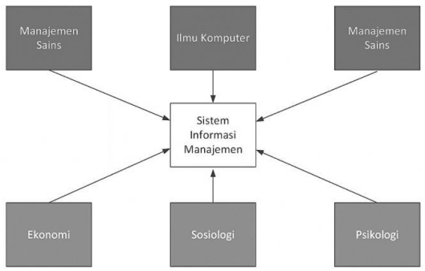
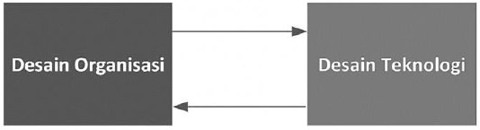

# Pendekatan Sosio-Teknikal

Dalam mempelajari suatu hal biasanya menggunakan pendekatan tertentu. Begitu pula dalam mempelajari Sistem Informasi Manajemen menggunakan beberapa pendekatan yang berbeda. Berbagai pendekatan tersebut akan dibahas dalam bagian ini. Pendekatan yang akan dibahas terdiri atas pendekatan teknis, perilaku, dan sosio-teknikal.

## Daftar Isi

- [Pendekatan Sosio-Teknikal](#pendekatan-sosio-teknikal)
  - [Daftar Isi](#daftar-isi)
  - [Pendekatan Teknis dalam Sistem Informasi Manajemen](#pendekatan-teknis-dalam-sistem-informasi-manajemen)
  - [Pendekatan Perilaku dalam Sistem Informasi Manajemen](#pendekatan-perilaku-dalam-sistem-informasi-manajemen)
  - [Pendekatan Sosio-Teknikal dalam Sistem Informasi Manajemen](#pendekatan-sosio-teknikal-dalam-sistem-informasi-manajemen)
  - [Rangkuman](#rangkuman)

## Pendekatan Teknis dalam Sistem Informasi Manajemen

Di masa lalu, mempelajari sistem informasi manajemen banyak menggunakan pendekatan teknis. Hal tersebut banyak dipengaruhi oleh banyaknya akademisi di bidang sistem informasi manajemen yang berasal dari latar belakang teknis seperti Teknik Informatika, Teknik Elektro, Teknik Industri, Ilmu Komputer, dan lain sebagainya. Pendekatan berdasarkan ilmu teknik ini sering disebut sebagai Hard Approach (Avison & Fitzgerald, 2006).

Pendekatan teknis yang digunakan dalam mempelajari sistem informasi biasanya berdasarkan pada penggunaan model matematika, teknologi fisik (perangkat keras), dan kemampuan formal suatu sistem informasi (Laudon & Laudon, 2018). Dalam perkembangannya, sistem informasi manajemen berkembang berdasarkan pengaruh besar dari disiplin Ilmu Komputer, Manajemen Sains, dan Operations Research.

Gambar 1.10
Pendekatan dalam Sistem Informasi Manajemen

Ilmu Komputer merupakan ilmu yang mempelajari teori komputabilitas, metode komputasi, dan metode bagaimana mengakses dan menyimpan data secara efisien. Ilmu Komputer adalah dasar matematis untuk teknologi informasi. Manajemen Sains merupakan ilmu yang berfokus pada pengembangan model-model ilmiah guna pembuatan keputusan dan praktik manajemen. Manajemen Sains berusaha untuk menggunakan metode ilmiah dalam berbagai aspek manajerial sehingga tata kelola perusahaan bukan lagi merupakan seni yang hanya dapat dipelajari dan dilakukan sedikit orang. Operations Research merupakan disiplin ilmu yang berfokus pada teknik matematika untuk melakukan optimalisasi pada beberapa parameter organisasi. Parameter tersebut antara lain transportasi dan logistik, pengendalian persediaan, dan biaya transaksi.

Seiring berjalannya waktu, menggunakan pendekatan berbasis ilmu teknik ternyata menemui banyak kendala. Kendala-kendala tersebut banyak yang bersifat non teknis, sehingga tidak dapat diselesaikan menggunakan pendekatan ilmu teknik. Untuk menjawab masalah non teknis tersebut, maka mulai banyak digunakan pendekatan berbasis perilaku (Avison & Fitzgerald, 2006; Laudon & Laudon, 2018).

## Pendekatan Perilaku dalam Sistem Informasi Manajemen

Pendekatan berbasis perilaku didasarkan pada aspek penting suatu sistem informasi adalah pada perilaku para penggunanya. Perilaku pengguna mempengaruhi suatu sistem informasi mulai dari awal pengembangannya sampai dengan perawatannya. Berbagai isu muncul seperti integrasi sistem informasi ke dalam strategi bisnis, perancangan, implementasi sistem, pendayagunaan sistem, dan tata kelolanya. Semua isu tersebut terkait dengan aspek perilaku. Pendekatan ini sering disebut sebagai Soft Approach (Avison & Fitzgerald, 2006).

Disiplin ilmu yang berkontribusi pada aspek perilaku antara lain sosiologi, psikologi, dan ekonomi. Sosiologi merupakan disiplin ilmu yang mempelajari bagaimana kelompok dan organisasi saling mempengaruhi dan dipengaruhi oleh sebuah sistem informasi. Saling mempengaruhi dapat terjadi pada tingkatan individu, kelompok, organisasi, dan masyarakat secara keseluruhan. Bidang Ilmu Psikologi mempelajari bagaimana individu sebagai pembuat keputusan memiliki persepsi terhadap dan menggunakan sebuah sistem informasi. Ilmu Ekonomi mempelajari bagaimana proses produksi produk digital, dinamika pasar digital, dan bagaimana sistem informasi baru mengubah pengendalian dan struktur biaya di dalam suatu perusahaan.

Pendekatan perilaku tidak serta merta berarti mengabaikan aspek teknologi informasi. Masalah perilaku dalam suatu organisasi sering dipicu oleh hadirnya suatu sistem informasi baru. Oleh karena itu, fokus pada pendekatan perilaku adalah pada bagaimana menyelesaikan masalah non teknis pada sistem informasi suatu organisasi menggunakan pendekatan yang non teknis pula.

## Pendekatan Sosio-Teknikal dalam Sistem Informasi Manajemen

Gambar 1.11
Pendekatan Sosio-Teknikal dalam Sistem Informasi Manajemen

Sebagai jalan tengah, mulai dekade 1970 digunakan pendekatan sosio-teknikal dalam sistem informasi. Pendekatan ini mulai digunakan dan dipelopori oleh Tavistoc Institute di London. Pendekatan sosio-teknikal menggunakan kombinasi dari berbagai pendekatan yang telah dibahas di atas guna menyelesaikan masalah pada suatu sistem informasi. Masalah tersebut seringkali merupakan kombinasi dari hal teknis dan non teknis yang saling terkait. Oleh karena itu, menggunakan satu pendekatan saja tidak akan menyelesaikan masalah secara tuntas.

Pendekatan sosio-teknikal memandang bahwa optimalisasi suatu sistem informasi harus dilakukan pada sisi sosial dan teknikal secara bersama-sama. Mengoptimalkan hanya salah satu sisi akan mengakibatkan masalah di sisi lain. Terkadang salah satu sisi harus ”dikalahkan” dan tidak dioptimalkan guna mencapai tujuan organisasi. Penggunaan perangkat teknologi informasi yang maju mungkin harus ditunda sampai dengan para personil yang akan menggunakannya diberi pelatihan yang memadai dan disusun rencana implementasi yang tepat.

## Rangkuman

1. Dalam mempelajari Sistem Informasi Manajemen digunakan tiga pendekatan, yaitu pendekatan teknis, pendekatan perilaku, dan pendekatan sosio-teknikal.
2. Pendekatan teknis sering juga disebut Hard Approach berdasarkan ilmu teknik dengan penggunaan model matematika, teknologi fisik, dan kemampuan formal sebuah sistem informasi.
3. Disiplin ilmu yang mempengaruhi pendekatan teknis adalah
   - Ilmu Komputer yang mempelajari teori komputabilitas, metode komputasi, dan metode akses dan penyimpanan data yang efisien secara matematis.
   - Manajemen Sains yang mempelajari dan mengembangkan pembuatan keputusan dan praktik manajemen berdasarkan metode ilmiah.
   - Operations Research yang mempelajari teknik optimalisasi berdasarkan matematika pada parameter organisasi seperti transportasi, logistik, pengendalian persediaan, dan biaya transaksi.
4. Pendekatan perilaku yang sering juga disebut Soft Approach lebih berfokus pada aspek perilaku manusia yang terlibat dalam sebuah Sistem Informasi.
5. Disiplin ilmu yang mempengaruhi pendekatan perilaku adalah:
   - Sosiologi yaitu ilmu yang mempelajari bagaimana kelompok dan organisasi saling mempengaruhi dan dipengaruhi oleh sistem informasi.
   - Psikologi yaitu ilmu yang mempelajari bagaimana seorang individu sebagai pembuat keputusan memiliki persepsi terhadap sistem informasi dan menggunakan sistem informasi.
   - Ekonomi yaitu ilmu yang mempelajari proses produksi barang digital, dinamika pasar barang digital, dan bagaimana suatu sistem informasi baru mengubah pengendalian dan struktur biaya perusahaan.
6. Pendekatan sosio-teknikal adalah pendekatan yang menggabungkan aspek-aspek pendekatan teknis dan perilaku. Pendekatan sosio-teknikal menggunakan pendekatan teknis dan perilaku guna menyelesaikan masalah karena suatu sistem informasi memiliki sisi teknis dan sisi perilaku dari manusia sebagai salah satu komponen sistem informasi.
